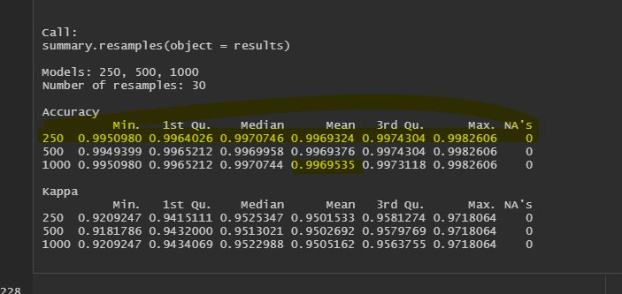
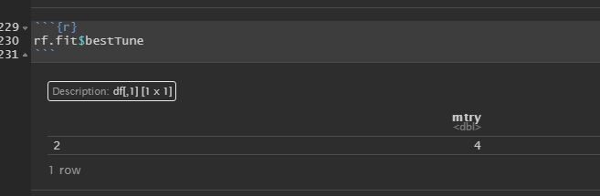
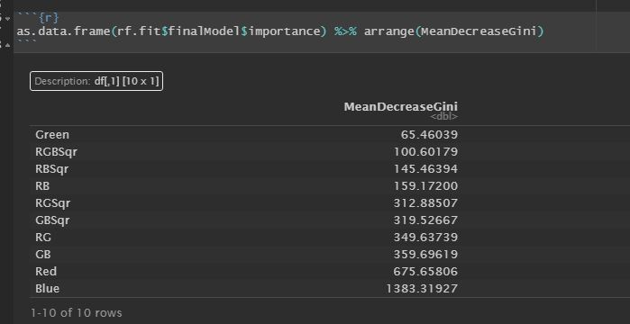

<!--- Below are global settings for knitr. You can override any of them by adding the changes to individual chunks --->

```{r global_options, include=FALSE}
knitr::opts_chunk$set(error=TRUE,        # Keep compiling upon error
                      collapse=FALSE,    # collapse by default
                      echo=TRUE,         # echo code by default
                      comment = "#>",    # change comment character
                      fig.width = 5.5,     # set figure width
                      fig.align = "center",# set figure position
                      out.width = "49%", # set width of displayed images
                      warning=TRUE,      # show R warnings
                      message=TRUE)      # show R messages
```

<!--- Change font sizes (or other css modifications) --->
<style>
h1.title {
3

  font-size: 2.2em; /* Title font size */
}
h1 {
  font-size: 2em;   /* Header 1 font size */
}
h2 {
  font-size: 1.5em;
}
h3 { 
  font-size: 1.2em;
}
pre {
  font-size: 0.8em;  /* Code and R output font size */
}
</style>


**SYS 6018 | Spring 2021 | University of Virginia **

*******************************************
# SYS 6018: Disaster Relief Project
**H. Diana McSpadden**

# Introduction 

When natural disasters or other emergencies result in compromised communications and transportation challenges, it can be impossible within a reasonable time to locate survivors using human-only methods. This disaster relief toy problem seeks to discover if an algorithm can effectively identify images corresponding to people who require relief.

To investigate whether this is possible a data set was provided containing RGB color values corresponding to pixels. The pixels are from high-resolution images taken by an aircraft above Haiti after the 2010 earthquake. Blue tarps had been distributed to survivors, but rescue workers did not have information about where survivors relocated after receiving the blue tarps. 

Blue tarps have a distinct color when compared to other identifiable elements in Haiti. The training data set includes 63,241 RGB values for pixels in the toy problem's images. The training data set includes a label for each pixel. The labels include:
<ul>
<li>Blue Tarp</li>
<li>Rooftop</li>
<li>Soil</li>
<li>Various Non-Tarp</li>
<li>Vegetation</li>
</ul>

Below the training data is explored, and various modeling methods are applied to determine if, and which method can be effectively used to identify blue tarps by RGB values.

# Training Data / EDA

```{r echo=FALSE}
#install.packages("pROC")
#install.packages("randomForest")
#install.packages("reticulate")
#install("regclass")
```


```{r load-packages, warning=FALSE, message=FALSE}
# Load Required Packages
library(tidyverse)
library(pROC)
library(randomForest)
library("GGally")
library(gridExtra)
library(plotly)
library(caret)
library(boot)
library(regclass)
library(MLeval)
library(ggplot2)
library(purrr)
library(broom)
library(e1071)
library(caret)
library(boot)
library(glmnet)
library(yardstick)
```

```{r load-data, message=FALSE, warning=FALSE}
filename = 'HaitiPixels.csv'
#url = 'https://collab.its.virginia.edu/access/lessonbuilder/item/1707832/group/17f014a1-d43d-4c78-a5c6-698a9643404f/Module3/HaitiPixels.csv' #this url is beng 
haiti <- read_csv(filename)
print(dim(haiti))

```
Below are the first 6 rows of the training dataset.

```{r data-head1}
head(haiti)
```

The dataframe contains 4 columns, and 63,241 rows. The Class column contains the correct label for the observation. Red, Green and Blue parameters are each values between 0 and 255 used in the additive RBG color model.

## Class Factor
To prepare the data for exploratory data analysis I make Class a factor.

```{r factorClass}
haiti %>% 
  mutate(Class = factor(Class)) 
```

Examine the numbers and percentages in each of the **5** classes:
```{r summarizeByCategory}
haiti %>%
  group_by(Class) %>%
  summarize(N = n()) %>%
  mutate(Perc = round(N / sum(N), 2) * 100)
```

#### Observations:
The records are not evenly distributed between the categories. Of the Classes, Blue Tarp, our "positive" category if we are thinking a binary positive/negative identification, is only 3% of our sample. Soil and Vegetation make up the majority of our sample at 74%.

## Binary Class Factor vs. 5 Class Factor
It will be interesting to see performance predicting each of these categories, or a binary is or is not Blue Tarp.

### Create Binary DataFrame

Create a DataFrame that is only Blue Tarp, or not Blue Tarp:
<ul>
<li> 0 == Not a Blue Tarp</li>
<li> 1 == Is a Blue Tarp</li>
</ul>

After reviewing box plots for the 2-class data set, I also created two new calculated variables:
<br />
1. GBSqr = (Green + Blue)^2 * .001
<br />
2. RBSqr = (Red + Blue)^2 * .001

I created these to continue using the Red and Green values, but I wanted to increase the difference in median value difference between the positive and negative classes. There is significant interplay in color values between Red, Green, and Blue in identifying the correct shade or blue, and I want to continue using Red and Green values but increase the linear separability between the classes. The 0.01 multiplier is to return the number scale to a range similar to standard RGB values, i.e, a manual "scaling" of the new parameters. 
```{r createBinaryDataFrame}
haitiBinary =  haiti %>%
  mutate(ClassBinary = if_else(Class == 'Blue Tarp', '1', '0'), ClassBinary = factor(ClassBinary))

haitiBinarySqrs = haiti %>%
  mutate(GBSqr = I(((Green + Blue)^2) * .001), RBSqr = I(((Red + Blue)^2) * .001), ClassBinary = if_else(Class == 'Blue Tarp', '1', '0'), ClassBinary = factor(ClassBinary))

```


Re-examine the numbers and percentages in each of the **2** classes:
```{r summarizeBinaryByCategory}

haitiBinary %>%
  group_by(ClassBinary) %>%
  summarize(N = n()) %>%
  mutate(Perc = round(N / sum(N), 2) * 100)

```

### How are red, blue and green values distributed between the **5** classes?

```{r colorValuesFiveCats, cache=TRUE, fig.height=5, fig.width=8}

redplot <- ggplot(haiti, aes(x=Class, y=Red)) + 
  geom_boxplot(col='red')

greenplot <- ggplot(haiti, aes(x=Class, y=Green)) + 
  geom_boxplot(col='darkgreen')

blueplot <- ggplot(haiti, aes(x=Class, y=Blue)) + 
  geom_boxplot(col='darkblue')

grid.arrange(redplot, greenplot, blueplot)
```


### How are red, blue and green values distributed between the **2** classes?

```{r colorValuesBinaryCats, cache=TRUE, fig.height=5, fig.width=5}

redplotB <- ggplot(haitiBinary, aes(x=ClassBinary, y=Red)) + 
  geom_boxplot(col='red')

greenplotB <- ggplot(haitiBinary, aes(x=ClassBinary, y=Green)) + 
  geom_boxplot(col='darkgreen')

blueplotB <- ggplot(haitiBinary, aes(x=ClassBinary, y=Blue)) + 
  geom_boxplot(col='darkblue')

grid.arrange(redplotB, greenplotB, blueplotB)
```
### How are red, blue and green values distributed between the **2** classes with the square values for Red + Blue and Green Blue?

```{r colorValuesBinarySqrsCats, cache=TRUE, fig.height=5, fig.width=5}

redplotB <- ggplot(haitiBinarySqrs, aes(x=ClassBinary, y=RBSqr)) + 
  geom_boxplot(col='red')

greenplotB <- ggplot(haitiBinarySqrs, aes(x=ClassBinary, y=GBSqr)) + 
  geom_boxplot(col='darkgreen')

blueplotB <- ggplot(haitiBinarySqrs, aes(x=ClassBinary, y=Blue)) + 
  geom_boxplot(col='darkblue')

grid.arrange(redplotB, greenplotB, blueplotB)
```

#### Box Plot Observations

**For the 5-class box plots:**

"Blue Tarp" as the "positive" result, and other results as the "negative" result.

Regarding the box plot of the five categories, of interest is that "Soil" and "Vegetation" are relatively unique in their RGB distributions. "Rooftop" and "Various Non-Tarp" are more similar in their RBG distributions

**For the 2-class box plots:**

If the classes are collapsed to binary values of "Blue Tarp (1)" and "Not Blue Tarp (0)" there is little overlap in the blue values for the two classes, and the ranges of red and green are much smaller for blue tarp than non-blue-tarp.
<br /><br />
Generally, the values of red have a larger range for negative results than for positive results, and the positive results have a similar median to the negative results.
<br /></br>
Green values have a larger range for negative results than for positive results, and the positive results have a higher median than the negative results. 
<br /><br />
There is ***almost*** **no overlap in the blue data** with non-blue tarps, and blue tarps.

**For the 2-class box plots with the additive square values:**

If the classes are collapsed to binary values of "Blue Tarp (1)" and "Not Blue Tarp (0)" there is little overlap in the blue values for the two classes, and the RBSqr and GBSqr values have much less overlap than without the additive square variables.
<br /><br />
The values of RBSqr have a larger range for negative results than for negative results, and median is significantly greater in the positive results.
<br /></br>
GBSqr values have a larger range for negative results than for positive results. The positive results have a significantly higher median than the negative results. 
<br /><br />
There is ***almost*** **no overlap in the blue data** with non-blue tarps, and blue tarps.

### View the correlation between Red, Green and Blue

These correlations make sense as the pixels were of highly saturated/"additive" colors. There are few pixels in the data set with low values for R,G,B.

```{r pairsHaiti5, cache=TRUE}
#ggpairs(haiti, lower = list(continuous = "points", combo = "dot_no_facet"), progress = F)
ggpairs(haiti, progress = F)
```

```{r pairsHaitiBinary, cache=TRUE}
#ggpairs(haiti, lower = list(continuous = "points", combo = "dot_no_facet"), progress = F)
ggpairs(haitiBinary[-1], progress = F)
```


```{r pairsHaitiBinarySqred, cache=TRUE}
ggpairs(haitiBinarySqrs[-1], progress = F)
```
The RBSqr and GBSqr have significantly less variance in their values, and better differentiation between the 2 classes than the Red and Green variables. I will be using these transformed variables in my models.

### 3-D Scatterplot

To view the relationship between the Red, Green, and Blue values between the five classes, and the binary classes, an interactive 3-D scatter plot is illustrative.


#### Five-Class 3-D Scatterplot
```{r 3D5Class, fig.width=6, fig.height=5, cache=TRUE}

fiveCat3D = plot_ly(x=haiti$Red, y=haiti$Blue, z=haiti$Green, type="scatter3d", mode="markers", color=haiti$Class, colors = c('blue2','azure4','chocolate4','coral2','chartreuse4'),
marker = list(symbol = 'circle', sizemode = 'diameter', opacity =0.35))

fiveCat3D = fiveCat3D %>%
  layout(title="5 Category RBG Plot", scene = list(xaxis = list(title = "Red", color="red"), yaxis = list(title = "Blue", color="blue"), zaxis = list(title = "Green", color="green")))

fiveCat3D

```
**5-Class 3-D Scatter Plot Observations**
<br />
One can see that there are discernible groupings of pixel categories by RGB values. Unsurprisingly, the blue tarps are higher blue values, but they do have a range of red and green values.
<br /><br />

The 3D scatter plot is particularly useful because, by zooming in, one can see that while the 'Blue Tarp' values are generally distinct, there is a space in the 3D plot with mingling of "blue tarp" pixels and other pixel categories. That area of the data will provide a challenge for our model.

##### Two-Class 3-D Scatterplot

```{r 3DBinary, , fig.width=6, fig.height=5, cache=TRUE}
binary3D = plot_ly(x=haitiBinarySqrs$RBSqr, y=haitiBinarySqrs$Blue, z=haitiBinarySqrs$GBSqr, type="scatter3d", mode="markers", color=haitiBinary$ClassBinary, colors = c('red','blue2'),
marker = list(symbol = 'circle', sizemode = 'diameter', opacity =0.35))

binary3D = binary3D %>%
  layout(title="Binary RBG Plot", scene = list(xaxis = list(title = "RBSqr", color="red"), yaxis = list(title = "Blue", color="blue"), zaxis = list(title = "GBSqr", color="green")))

binary3D
```
**2-Class 3-D Scatter Plot Observations With Blue, GBSqr, and RBSqr**
<br />
Similar to the five category 3D scatter plot, the binary scatter plot shows distinct groupings for blue tarp and non-blue-tarp. Visually, there is an near-distinct linear boundary between the blue tarp and non-blue tarp observations. 


### Parameter Selection:
Based on EDA, I am hopeful that my models will perform well using the following predictors:
<ol>
<li>Red</li>
<li>Green</li>
<li>Blue</li>
<li>GBSqr: ((Green + Blue)^2) * .001</li>
<li>RBSqr: ((Red + Blue)^2) * .001</li>
</ol>


# Model Training

## Set-up 

I so not consider normalization or additional scaling because the ranges of Red, Green, Blue, RBSqr, and GBSqr are the same.
<br /><br/>
I am using the 2-Class data set for the following reasons:
<ol>
<li>The distinctions in the 2-Class data set, as seen in the 3-D scatterplot, are clear.</li>
<li>The stated problem is to classify 'Blue Tarp' from the other classes. Classifying the other classes is not of interest.</li>
<li>I am using 10-fold cross-validation to evaluate various models.</li>
</ol>

## Cross-Validation Performance 

For logistic regression, LDA, QDA, KNN  and Penalized Logistic Regression Cross-Validation threshold performance use ROC and Accuracy for tuning.

The following performance measures are collected for both the 10-fold cross-validation and the hold-out/testing/validation data:
<ul>
<li>AUROC</li>
<li>True Positive Rate</li>
<li>False Positive Rate</li>
<li>Precision</li>
</ul>

<br /><br />
For the Models:
* **No**: Not a Blue Tarp is **Negative**
* **Yes**: Is a Blue Tarp is **Positive**

## Logistic Regression

In order to use R's built-in factor function I set ClassBinary to a factor and order it "No", "Yes". 
<br />
I also review the factor counts and create a dataframe named "train".

```{r reviewSqrsLevel}
levels(haitiBinarySqrs$ClassBinary)

levels(haitiBinarySqrs$ClassBinary)=c("No","Yes")

levels(haitiBinarySqrs$ClassBinary)

fct_count(haitiBinarySqrs$ClassBinary)
```

### Comparison of Three Logistic Regression Models
Using 10-fold cross validation and p values in the collection (.1,.2,.3,.35,.4,.5,.6,.7,.8,.9) I tested three models:
<br />
** Model 1: Greatest Complexity:**
$$ClassBinary = Blue + GBSqr + RBSqr \hspace{.3cm} | \hspace{.3cm} GBSqr = (Green + Blue)^2 \hspace{.3cm} and \hspace{.3cm} RBSqr = (Red + Blue)^2$$

** Model 2: Standard Additive Model:**
$$ClassBinary = Blue + Green + Red$$

** Model 3: Simple Logistic Regression Model:**
$$ClassBinary = Blue$$
```{r logRegressionTuning, warning=FALSE, cache=TRUE}
library(yardstick)

set.seed(1976)
#Randomly shuffle the data
haitiBinarySqrsShuffled = haitiBinarySqrs[sample(nrow(haitiBinarySqrs)),]

#Create 10 equally size folds
folds <- cut(seq(1,nrow(haitiBinarySqrsShuffled)),breaks=10,labels=FALSE)

# create storage variables for the p value, ROC, Specificity, and Sensitivity
k_start = 1
k_end = 17
out_nvar = k_end - k_start + 1

p_i = rep(NA, out_nvar)
# complex model measures
sensitivity_c_i = rep(NA, out_nvar)
specificity_c_i = rep(NA, out_nvar)
prec_c_i = rep(NA, out_nvar)

# additive model measures
sensitivity_a_i = rep(NA, out_nvar)
specificity_a_i = rep(NA, out_nvar)
prec_a_i = rep(NA, out_nvar)

# simple model measures
sensitivity_s_i = rep(NA, out_nvar)
specificity_s_i = rep(NA, out_nvar)
prec_s_i = rep(NA, out_nvar)

counter = 1

for (j in c(.1,.2,.3,.35,.4, .5,.6,.7,.8,.9))
{ 

  p_i[counter] = j
  
  accumulator_c_sens = 0
  accumulator_c_spec = 0
  accumulator_c_prec = 0
  accumulator_a_sens = 0
  accumulator_a_spec = 0
  accumulator_a_prec = 0
  accumulator_s_sens = 0
  accumulator_s_spec = 0
  accumulator_s_prec = 0
  
  #Perform 10 fold cross validation
  for(i in 1:10) {
    
      #Segement your data by fold using the which() function 
      testIndexes = which(folds==i,arr.ind=TRUE)
      testData = haitiBinarySqrsShuffled[testIndexes, ]
      trainData = haitiBinarySqrsShuffled[-testIndexes, ]
      
      # define complex model
      glm.fits.complex = glm(ClassBinary ~ Blue+Green+Red+GBSqr+RBSqr, binomial, data = trainData)
      # define additive model
      glm.fits.additive = glm(ClassBinary ~ Blue+Green+Red, binomial, data = trainData)
      # define simple model
      glm.fits.simple = glm(ClassBinary ~ Blue, binomial, data = trainData)
      
      # fit the complex model
      glm.pred.complex = glm.fits.complex %>%  augment(newdata=testData) %>% 
        dplyr::select(ClassBinary, .fitted)  %>% 
        mutate(ClassBinary=factor(ClassBinary))%>%
        mutate(.prediction=ifelse(1 - 1/(1 + exp(.fitted)) < j, "No", "Yes")) %>%
        mutate(.prediction=fct_relevel(as_factor(.prediction), c("No", "Yes"))) 
      
      if (nlevels(glm.pred.complex$.prediction) > 1)
      {
        accumulator_c_sens = accumulator_c_sens + yardstick::sens(glm.pred.complex, ClassBinary, .prediction)[[3]]
        accumulator_c_spec = accumulator_c_spec + yardstick::spec(glm.pred.complex, ClassBinary, .prediction)[[3]]
        accumulator_c_prec = accumulator_c_prec + yardstick::precision(glm.pred.complex, ClassBinary, .prediction)[[3]]
      }
      
      # fit the additive model
      glm.pred.additive = glm.fits.additive %>%  augment(newdata=testData) %>% 
        dplyr::select(ClassBinary, .fitted)  %>% 
        mutate(ClassBinary=factor(ClassBinary))%>%
        mutate(.prediction=ifelse(1 - 1/(1 + exp(.fitted)) < j, "No", "Yes")) %>%
        mutate(.prediction=fct_relevel(as_factor(.prediction), c("No", "Yes"))) 
      
      if (nlevels(glm.pred.additive$.prediction) > 1)
      {
        accumulator_a_sens = accumulator_a_sens + yardstick::sens(glm.pred.additive, ClassBinary, .prediction)[[3]]
        accumulator_a_spec = accumulator_a_spec + yardstick::spec(glm.pred.additive, ClassBinary, .prediction)[[3]]
        accumulator_a_prec = accumulator_a_prec + yardstick::precision(glm.pred.additive, ClassBinary, .prediction)[[3]]
      }
      
      # fit the simple model
      glm.pred.simple= glm.fits.simple %>%  augment(newdata=testData) %>% 
        dplyr::select(ClassBinary, .fitted)  %>% 
        mutate(ClassBinary=factor(ClassBinary))%>%
        mutate(.prediction=ifelse(1 - 1/(1 + exp(.fitted)) < j, "No", "Yes")) %>%
        mutate(.prediction=fct_relevel(as_factor(.prediction), c("No", "Yes"))) 
      
      if (nlevels(glm.pred.simple$.prediction) > 1)
      {
        accumulator_s_sens = accumulator_s_sens + yardstick::sens(glm.pred.simple, ClassBinary, .prediction)[[3]]
        accumulator_s_spec = accumulator_s_spec + yardstick::spec(glm.pred.simple, ClassBinary, .prediction)[[3]]
        accumulator_s_prec = accumulator_s_prec + yardstick::precision(glm.pred.simple, ClassBinary, .prediction)[[3]]
      }
      
  }

  sensitivity_c_i[counter] = accumulator_c_sens / 10
  specificity_c_i[counter] = accumulator_c_spec / 10
  prec_c_i[counter] = accumulator_c_prec /10
  
  sensitivity_a_i[counter] = accumulator_a_sens / 10
  specificity_a_i[counter] = accumulator_a_spec / 10
  prec_a_i[counter] = accumulator_a_prec /10
  
  sensitivity_s_i[counter] = accumulator_s_sens / 10
  specificity_s_i[counter] = accumulator_s_spec / 10
  prec_s_i[counter] = accumulator_s_prec /10
  
  counter = counter + 1
}

outcome = data.frame(p_i, sensitivity_c_i, specificity_c_i, prec_c_i, sensitivity_a_i, specificity_a_i, prec_a_i, sensitivity_s_i, specificity_s_i, prec_s_i)

print(outcome, n = nrow(outcome))


```
**SLR Model 3: ClassBinary = Blue**<br />
Only p values of .1, .2, .3 and .35 are of interest in the SLR model. This model was unable to meaningfully differentiate between blue tarps and not blue tarps. The sensitivity, specificity and precision did not approach the performance of the other two models. Model 3 will no longer be considered.
<br />
**Model 1 and Model 2**<br />
The differences between Model 1, the more complex mode, and Model 2, the additive model without the square terms, are more nuanced.
<ul>
<li>The highest **precision** for both models was with p == 0.1:
  <li>Model 3: 0.9993</li>
  <li>Model 2 == 0.9988</li>
</li>
<li>The highest **specificity** (which because of the way the data is setup is actually the **true positive rate**) for both models was with p == 0.1: 
  <li>Model 3: 0.9793</li>
  <li>Model 2: 0.9630</li>
</li>
<li>The highest **sensitivity** for both models was with p == 0.95: 
  <li>Model 3: 0.9996</li>
  <li>Model 2: 0.9997</li>
</li>
</ul>

<br />
**Model 3**, with the square terms, performed better on all measures.
<br />
Because geographic distribution of blue tarps is not included in this data, I will focus on True Positive Rate, because I want to identify the most blue tarps that I can. I could see how in some situations, with limited personelle and resources, other measure may be of more utility. But, I will assume infinite resources, which leads me to use **True Positive Rate** as my measure for tuning and model selection.

### Logistic Regression Performance
Below I use the entire training data set on the model with p = 0.1 to get the training Accuracy, TPR, FPR, and Precision:

```{r warning = FALSE, cache=TRUE}
set.seed(1976)
#Randomly shuffle the data
haitiBinarySqrsShuffled = haitiBinarySqrs[sample(nrow(haitiBinarySqrs)),]

#Create 10 equally size folds
folds <- cut(seq(1,nrow(haitiBinarySqrsShuffled)),breaks=10,labels=FALSE)

out_lr.complex = tibble()

#Perform 10 fold cross validation
for(i in 1:10) {
  
    #Segement your data by fold using the which() function 
    testIndexes = which(folds==i,arr.ind=TRUE)
    testData = haitiBinarySqrsShuffled[testIndexes, ]
    trainData = haitiBinarySqrsShuffled[-testIndexes, ]
    
    
    # define complex model
    glm.fits.complex = glm(ClassBinary ~ Blue+Green+Red+GBSqr+RBSqr, binomial, data = trainData)

    # fit the complex model
    glm.pred.complex = glm.fits.complex %>%  augment(newdata=testData) %>% 
      dplyr::select(ClassBinary, .fitted)  %>% 
      mutate(ClassBinary=factor(ClassBinary))%>%
      mutate(.prediction=ifelse(1 - 1/(1 + exp(.fitted)) < .1, "No", "Yes")) %>%
      mutate(.prediction=fct_relevel(as_factor(.prediction), c("No", "Yes"))) 
    
    out_lr.complex = bind_rows(out_lr.complex, 
            tibble(truth = testData$ClassBinary, 
                   prediction = glm.pred.complex$.prediction,
                   fitted = glm.pred.complex$.fitted))
    
}

caret::confusionMatrix(out_lr.complex$prediction, out_lr.complex$truth)


```

For Logistic Regression, my calculations for Accuracy, TPR, FPR, and Precision treat 'Yes', i.e. "yes, it is a blue tarp", as the positive class.

The following cross-validation measures were calculated with a threshold, p, of 0.1:
<ul>
<li>Accuracy: 0.9957</li>
<li>TPR: 1981 / 2022 = 0.98</li>
<li>FPR: 232 / 61219 = 0.0038</li>
<li>Precision: 1981 / 2212 = 0.896</li>
</ul>

### Logistic Regression Cross-Validation ROC Curve:

```{r LogROCCurve, warning=FALSE, cache=TRUE}
library(ROCR)

# create a function so I can use repeatedly
function_ROC_AUC = function(fitted, truth, title)
{
  ##produce the numbers associated with classification table
  rates = prediction(fitted, truth)
  
  ##store the true positive and false postive rates
  roc_result = performance(rates, measure = "tpr", x.measure = "fpr")
  
  par(mfrow=c(1,2))

  ##plot ROC curve and overlay the diagonal line for random guessing
  plot(roc_result, main = title)
  lines(x = c(0,1), y = c(0,1), col="red")
  
  plot(roc_result, avg= "vertical", spread.estimate="boxplot", lwd=2,col='blue',
      show.spread.at= seq(0.1, 0.9, by=0.1),
      main= "Accuracy across cutoffs", xlab="Threshold cutoff")
  
  ##compute the AUC
  auc = performance(rates, measure = "auc")
  print(auc@y.values[[1]])
}

function_ROC_AUC(out_lr.complex$fitted, out_lr.complex$truth, "ROC For Tuned Complex Logisitic Regressions Model")

```

The Logistic Regression ROC-AUC for the 10-fold cross-validated training data with p=0.1 is: **0.9996**. 

## LDA

I trained the LDA model using 10-fold cross validation. 

10-fold cross validation was used for p-values from 0.1 to .95. Tuning was performed using ROC.

I tested with thresholds in c(.1, .2, .3, .4, .5, .6, .7, .8, .85, .9, .95). The best performing threshold on accuracy was 0.3. For illustrative purposes I run with 0.3, and 0.4.

```{r ldaCrossValidationAccuracy, cache=TRUE, warning=FALSE}
#y_true

set.seed(1976)

haitiBinarySqrsShuffled = haitiBinarySqrs[sample(nrow(haitiBinarySqrs)),]
#Create 10 equally size folds
folds <- cut(seq(1,nrow(haitiBinarySqrsShuffled)),breaks=10,labels=FALSE)

trctrl <- trainControl(method = "cv", summaryFunction=twoClassSummary, classProbs=T, savePredictions = T)

out_lda_p = tibble()

#Perform 10 fold cross validation
for(i in 1:10) {
  
    #Segement your data by fold using the which() function 
    testIndexes = which(folds==i,arr.ind=TRUE)
    testData = haitiBinarySqrsShuffled[testIndexes, ]
    trainData = haitiBinarySqrsShuffled[-testIndexes, ]
    
    train_lda <- train(ClassBinary ~ Blue+Green+Red+GBSqr+RBSqr, data = trainData, method = "lda", trControl = trctrl, tuneLength=10)
    
    # test with the fold's test data
    preds = predict(train_lda, newdata = testData, type="prob")
    
    #- evaluate fold k
    y_true = testData$ClassBinary
    # check the threshold
    # TO DO: ADD LOOP OVER p values of .1, .2, .3, .4, .5, .6, .7, .8, .85, .9, .95
    #for (p in c(.2, .8)){
    for (p in c(0.1, 0.2, 0.3, 0.4, 0.5)){
      #y_hat = tibble(hat_pred = preds$Yes > p) %>% mutate(hat_value = ifelse(preds$Yes > p))
      y_hat = preds %>% mutate(hat_value = factor(ifelse(Yes > p, "Yes", "No")))
      
      #spec(two_class_example, truth, predicted)
      spec = yardstick::spec(preds, y_true, y_hat$hat_value)[[3]]
      
      #acc = apply(y_hat, 2, function(y) mean(y == y_true))
      
        #- output
      out_lda_p = bind_rows(out_lda_p, tibble(threshold = p, TPR = spec))
    }
}

out_lda_p

```

```{r getMeanLDATPR, cache=TRUE}
#-- Get mean accuracy
perf_lda_p = out_lda_p %>% 
  group_by(threshold) %>% 
  summarize(mean_TPR = mean(TPR)) 

perf_lda_p %>% arrange(-mean_TPR)
```

The threshold with the **greatest true positive rate** using a LDA model uses a probability threshold of **0.1**.

```{r trainLDAWithBestAccuracy, cache=TRUE, warning=FALSE}

# tibble to save all predictions at the best threshold
out_best_lda = tibble()
out_all_preds = tibble()

 #Perform 10 fold cross validation
for(i in 1:10) {

  #Segement your data by fold using the which() function 
  testIndexes = which(folds==i,arr.ind=TRUE)
  testData = haitiBinarySqrsShuffled[testIndexes, ]
  trainData = haitiBinarySqrsShuffled[-testIndexes, ]
  
  train_lda <- train(ClassBinary ~ Blue+Green+Red+GBSqr+RBSqr, data = trainData, method = "lda", trControl = trctrl, tuneLength=10)
  
  # test with the fold's test data
  preds = predict(train_lda, newdata = testData, type="prob")
  
  #- evaluate fold k
  y_true = testData$ClassBinary
  y_hat = preds %>% mutate(hat_value = ifelse(Yes > 0.1, "Yes", "No")) %>% select(hat_value)

  #- output
  out_best_lda = bind_rows(out_best_lda, tibble(pred = y_hat$hat_value, truth = testData$ClassBinary))
  out_all_preds = bind_rows(out_all_preds, tibble(Yes = preds$Yes))
}
```

```{r ldaTrainConfusionMatrix, cache=TRUE}

out_best_lda = out_best_lda %>% mutate(pred = factor(pred), truth = factor(truth))

caret::confusionMatrix(out_best_lda$pred, out_best_lda$truth)
```
For LDA, my calculations for TPR, FPR, and Precision treat 'Yes', i.e. "yes, it is a blue tarp", as the positive class.
<ul>
<li>Accuracy: 0.9888</li>
<li>TPR: 1785 / 2022: 0.8827</li>
<li>FPR: 472 / 61219: 0.0077</li>
<li>Precision: 0.7909</li>
</ul>

### LDA Training ROC Curve:
```{r ldaTrainingROC, cache=TRUE}
function_ROC_AUC(out_all_preds$Yes, out_best_lda$truth, "ROC For Tuned LDA Model")
```

The **LDA AUC** based on 10-fold cross-validated training data with a threshold of 0.3 is: **0.99**.

## QDA

I trained the QDA model using 10-fold cross validation. 

10-fold cross validation was used and various thresholds were evaluated for best true positive rate. 

**0.1** produced the highest accuracy. For illustrative purposes I only test thresholds of 0.1, 0.2, an 0.3.
```{r qdaCrossValidation, warning=FALSE, cache=TRUE}
set.seed(1976)

# I will use the same folds calculated in the LDA code# 

trctrl <- trainControl(method = "cv", summaryFunction=twoClassSummary, classProbs=T, savePredictions = T)

out_qda_p = tibble()
# TO DO: ADD LOOP OVER p values of .1, .2, .3, .4, .5, .6, .7, .8, .85, .9, .95
#for (p in c(.3, .4)){


   #Perform 10 fold cross validation
for(i in 1:10) {
  
    #Segement your data by fold using the which() function 
    testIndexes = which(folds==i,arr.ind=TRUE)
    testData = haitiBinarySqrsShuffled[testIndexes, ]
    trainData = haitiBinarySqrsShuffled[-testIndexes, ]
    
    train_qda <- train(ClassBinary ~ Blue+Green+Red+GBSqr+RBSqr, data = trainData, method = "qda", trControl = trctrl, tuneLength=10)
    
    # test with the fold's test data
    preds = predict(train_qda, newdata = testData, type="prob")
    
    #- evaluate fold k
    #for (p in c(0.1, 0.2, 0.3, 0.4, 0.5, 0.6, 0.7, 0.8, 0.9)){
    for (p in c(0.1, 0.2, 0.3)){
      y_true = testData$ClassBinary
      # check the threshold
      y_hat = preds %>% mutate(hat_value = factor(ifelse(Yes > p, "Yes", "No")))
      
      
      #spec(two_class_example, truth, predicted)
      spec = yardstick::spec(preds, y_true, y_hat$hat_value)[[3]]
      
      #acc = apply(y_hat, 2, function(y) mean(y == y_true))
      
        #- output
      out_qda_p = bind_rows(out_qda_p, tibble(threshold = p, TPR = spec))
    }
}


```

```{r getMeanQDAAccuracy}
#-- Get mean accuracy
perf_qda_p = out_qda_p %>% 
  group_by(threshold) %>% 
  summarize(mean_TPR = mean(TPR)) 

perf_qda_p %>% arrange(-mean_TPR)
```
Based on the highest **True Positive Rate** of cross validation of the training data, I am selecting a threshold of **0.1** for the QDA model.

```{r trainQDAWithBestAccuracy, cache=TRUE, warning=FALSE}

# tibble to save all predictions at the best threshold
out_best_qda = tibble()
out_all_preds_qda = tibble()

 #Perform 10 fold cross validation
for(i in 1:10) {

  #Segement your data by fold using the which() function 
  testIndexes = which(folds==i,arr.ind=TRUE)
  testData = haitiBinarySqrsShuffled[testIndexes, ]
  trainData = haitiBinarySqrsShuffled[-testIndexes, ]
  
  train_qda <- train(ClassBinary ~ Blue+Green+Red+GBSqr+RBSqr, data = trainData, method = "qda", trControl = trctrl, tuneLength=10)
  
  # test with the fold's test data
  preds = predict(train_qda, newdata = testData, type="prob")
  
  #- evaluate fold k
  y_true = testData$ClassBinary
  y_hat = preds %>% mutate(hat_value = ifelse(Yes > 0.1, "Yes", "No")) %>% select(hat_value)

  #- output
  out_best_qda = bind_rows(out_best_qda, tibble(pred = y_hat$hat_value, truth = testData$ClassBinary))
  out_all_preds_qda = bind_rows(out_all_preds_qda, tibble(Yes = preds$Yes))
}
```

```{r qdaTrainConfusionMatrix, cache=TRUE}

out_best_qda = out_best_qda %>% mutate(pred = factor(pred), truth = factor(truth))

caret::confusionMatrix(out_best_qda$pred, out_best_qda$truth)
```

For QDA, my calculations for TPR, FPR, and Precision treat 'Yes', i.e. "yes, it is a blue tarp", as the positive class.
<ul>
<li>Accuracy: 0.9922</li>
<li>TPR: 1873 / (2022): 0.926</li>
<li>FPR: 346 / 61219: 0.006</li>
<li>Precision: 0.8441</li>
</ul>


### QDA Training ROC Curve:
```{r qdaTrainingROC, cache=TRUE}
function_ROC_AUC(out_all_preds_qda$Yes, out_best_qda$truth, "ROC For Tuned QDA Model")
```

The **QDA AUC** based on 10-fold cross-validated training data with a threshold of 0.1 is: **0.997**.

## KNN

### Tuning Parameter $k$

After testing over ranges from 1 to 51, the best k was **27**. The code used is shown below, but not evaluated.

```{r knnTry1, cache=TRUE, warning=FALSE, eval=FALSE}
set.seed(1976)

trControl.knn <- trainControl(method = "repeatedcv", summaryFunction=twoClassSummary, classProbs=T, savePredictions = T)

knn.cv.model = train(ClassBinary ~ Blue+Green+Red+GBSqr+RBSqr, data = train, method = "knn", trControl=trControl.knn, tuneGrid = expand.grid(k = 26:28))
knn.cv.model
```

```{r knnTry2, warning=FALSE, cache=TRUE, eval=FALSE}
set.seed(1976)

knn.cv.model = train(ClassBinary ~ Blue+Green+Red+GBSqr+RBSqr, data = train, method = "knn", trControl=trctrl, tuneGrid = expand.grid(k = 17:35))
knn.cv.model
```
I order to speed up this Rmd file I am no longer evaluating the following code chunk that evaluated k = 27 - 51. When this chunk is run, the best k was still 27.
```{r knnTry3, warning=FALSE, cache=TRUE, eval=FALSE}
set.seed(1976)

knn.cv.model = train(ClassBinary ~ Blue+Green+Red+GBSqr+RBSqr, data = train, method = "knn", trControl=trctrl, tuneGrid   = expand.grid(k = 27:51))
knn.cv.model

```
#### Results of Tuning for K

I ran 10-fold cross-validation for several ranges of k:
<ul>
<li>1 - 21: Returned best k == ***17***</li>
<li>17 - 35: Returned best k == ***27***</li>
<li>27 - 51: Returned best k == ***27***</li>
</ul>

<br /><br />
From 1 - 51, the best k is **27**. The tables of ROC, Sensitivity and Specificity were reviewed for each cross-validation training. From these tables one can see that the improvements within the range are in the hundredths of a percentage point of ROC, so k's in the range of 10 - 51, appear reasonable selections for the cross-validated training data.


### Tune the probability threshold, p, for KNN | k = 27

Running manual KNN cross validation to tune for p took significant time for my laptop to process. I ran with smaller lists of p just to get a feel for the results. 

The threshold  0.1 returned the same true positive rate with k == 27.

For processing speed time, I commented out the extending loop of threshold values, and limited the list of 0.1 and 0.2 for illustrative purposes.

```{r tunePKNN, cache=TRUE}
library(class)

out_knn_p = tibble()

set.seed(1976)

haitiBinarySqrsShuffled = haitiBinarySqrsShuffled %>% mutate(ClassBinaryTF = factor(if_else(ClassBinary == "No", FALSE, TRUE)))

for (j in 1:10)
{

  #Segement your data by fold using the which() function 
  testIndexes = which(folds==j,arr.ind=TRUE)
  testData = haitiBinarySqrsShuffled[testIndexes, ]
  trainData = haitiBinarySqrsShuffled[-testIndexes, ] 

  train_knn <- train(ClassBinary ~ Blue+Green+Red+GBSqr+RBSqr, data = trainData, method = "knn", tuneGrid = data.frame(k=27))

  # test with the fold's test data
  preds = predict(train_knn, newdata = testData, type="prob")
  
  #for (p in c(.1,.2,.3,.4,.5))
  for (p in c(.1,.2)) 
  {
  
    #- evaluate fold k
    y_true = testData$ClassBinaryTF
    # set the threshold to p
    thres = p
    y_hat = preds %>% mutate(hat_value = (Yes > thres), hat_value = factor(hat_value))
    
    #spec(two_class_example, truth, predicted)
    spec = yardstick::spec(preds, y_true, y_hat$hat_value)[[3]]

    #- output
    out_knn_p = bind_rows(out_knn_p, tibble(threshold = p, TPR = spec))
  }
}

#out_knn_p
```

```{r getMeanKNNAccuracy, cache=TRUE}
#-- Get mean accuracy
perf_knn_p = out_knn_p %>% 
  group_by(threshold) %>% 
  summarize(mean_TPR = mean(TPR)) 

perf_knn_p %>% arrange(-mean_TPR)
```

#### Results of Tuning for p:

After testing the following values of p: 0.1, 0.2, 0.3, 0.4, 0.5, 0.6, 0.7, 0.8, 0.9, **p == 0.1** is the value that produced the highest true positive rate.

```{r knnBestThres, cache=TRUE}
out_knn_best_thres = tibble()

for (j in 1:10)
{

  #Segement your data by fold using the which() function 
  testIndexes = which(folds==j,arr.ind=TRUE)
  testData = haitiBinarySqrsShuffled[testIndexes, ]
  trainData = haitiBinarySqrsShuffled[-testIndexes, ] 

  train_knn_best_thres <- train(ClassBinary ~ Blue+Green+Red+GBSqr+RBSqr, data = trainData, method = "knn", tuneGrid = data.frame(k=27))

  # test with the fold's test data
  preds_best_thres = predict(train_knn_best_thres, newdata = testData, type="prob")

  #- evaluate fold k
  y_true = testData$ClassBinaryTF
  y_hat = preds_best_thres %>% mutate(hat_value = (Yes > 0.1), hat_value = factor(hat_value))
  
  out_knn_best_thres = bind_rows(out_knn_best_thres,
                                 tibble(y_true = y_true, pred_Yes = y_hat$Yes, pred_No = y_hat$No, y_hat = y_hat$hat_value))
}

```


```{r knnTrainConfusionMatrix, cache=TRUE}
out_knn_best_thres = out_knn_best_thres %>%
  mutate(y_true = factor(y_true), y_hat = factor(y_hat))

caret::confusionMatrix(out_knn_best_thres$y_hat, out_knn_best_thres$y_true)
```
For KNN, my calculations for TPR, FPR, and Precision treat 'Yes', i.e. "yes, it is a blue tarp", as the positive class.
<ul>
<li>Accuracy: 0.9948</li>
<li>TPR: 1995 / (2022): 0.9866</li>
<li>FPR: 301 / 61219: 0.005</li>
<li>Precision: 0.8689</li>
</ul>


### KNN k=27 Training ROC Curve:
```{r knnTrainingROC, cache=TRUE}

function_ROC_AUC(out_knn_best_thres$pred_Yes, out_knn_best_thres$y_true, "ROC For Tuned KNN | k = 27 Model")
```
  


## Penalized Logistic Regression (ElasticNet)
Subset selection using glmnet/ElasticNet provides an opportunity for me to see if additional predictors are of use improving the precision of our model.

I added additional terms to the model. I selected additional additive relations between the colors because RGB color is, by design, an additive color model. The interplay between Red, Blue, and Green are intuitively significant because the combinations of these values create the visible spectrum of color. 

The predictors in the ElasticNet model are:
<ul>
<li>Red</li>
<li>Blue</li>
<li>Green</li>
<li>GBSqr = $(Green + Blue)^2$</li>
<li>RBSqr = $(Red + Blue)^2$</li>
<li>RGSqr = $(Red + Green)^2$</li>
<li>RGBSqr = $(Red + Blue + Green)^2$</li>
</ul>

```{r}
haitiBinaryFull = haitiBinarySqrs %>%
  mutate(RGSqr = I(((Red + Green)^2)),  RGBSqr = I(((Red + Green + Blue)^2))) 
```

```{r}
head(haitiBinaryFull)
```

I did not scale the predictors because the glmnet library will scale to standard deviation units. For the glmnet library, the training data must be in matrix format:

```{r glmnet-creatematrix}
frmla = as.formula(ClassBinary~Red+Green+Blue+GBSqr+RBSqr+RGSqr+RGBSqr)

x.haitiFull.train = model.matrix(frmla, data = haitiBinaryFull)[,-1] # removing the intercept term from the formula

# switch ClassBinary to TRUE FALSE to facilitate the next bit of code
y.haitiFull.train = (haitiBinaryFull %>% mutate(ClassBinary = ifelse(ClassBinary == 'No', FALSE, TRUE)))$ClassBinary

```


Using penalized logistic regression (PLR), I evaluated three different PLR methods: ridge, lasso, and elasticnet (a combination of ridge and lasso). I tuned both lambda and the probability threshold (p). Based on best testing of the threshold tuning parameter, I considered p values of .1, .2, .3, .4, .5, .6, .7, .8, .85, .9, .95.

For the sake of processing speed I commented out the loop for the extended p values (0.2 was the best threshold when I considered the extended list), and kept 0.1, 0.2, 0.3 for illustrative purposes.

After testing ridge, elasticnet, and lasso, lasso performed the best. For speed of processing, I am only demonstrating the loop with a == 1 == lasso.

**Accuracy** was used for tuning parameter and threshold tuning:
```{r glmnetCrossVal, cache=TRUE}
library(glmnet)
set.seed(1976)
# number of folds
K = 10
# make folds
folds = rep(1:K, length=nrow(x.haitiFull.train)) 
out = tibble()
# LOOP FOR alpha: 0 (ridge), 0.5 (elasticnet), and 1 (lasso)
for (a in c(1)){
  # lambda may be different for the different PLR methods, so this is decided within the alpha loop
  #-- Get lambda sequence so consistent over all folds
  lam_seq = glmnet(x.haitiFull.train, y.haitiFull.train, family="binomial", alpha=a)$lambda
  # TO DO: ADD LOOP OVER p values of .1, .2, .3, .4, .5, .6, .7, .8, .85, .9, .95
  #for (p in c(.1, .2, .3, .4, .5, .6, .7, .8, .85, .9, .95)){
  for (p in c(0.1,0.2,0.3)){
    #-- Loop over K folds
    for(k in unique(folds)){
      
      #- Get train/test split for fold k
      ind.train = which(folds != k)
      ind.test = which(folds == k)
      
      #- fit the alpha model over all lambdas in lam_seq
      fit.model = glmnet(x.haitiFull.train[ind.train,], y.haitiFull.train[ind.train], 
                                 alpha = a,          # use the alpha for the loop
                                 family="binomial",  # logistic regression
                                 lambda = lam_seq)   # all models in this alpha loop use same lambda sequence
      
      #- make predictions on test set fold k
      pred = predict(fit.model, x.haitiFull.train[ind.test, ], s=lam_seq, type = "response")
      
      #- evaluate fold k
      y_true = y.haitiFull.train[ind.test]
      # set the threshold to p
      y_hat = pred > p
      acc = apply(y_hat, 2, function(y) mean(y == y_true))
      
      #- output
      out = bind_rows(out, 
                tibble(accuracy = acc, 
                       lambda = lam_seq,
                       n_train = length(ind.train),
                       n_test = length(ind.test),
                       alpha = a,
                       thres = p,
                       k = k))
    }
  }
}
```

```{r glmnetLassoAlpha, cache=TRUE}
#head(out)

#-- Get mean TPR by alpha, threshold, and lambda for 10 fold cross validation
perf = out %>% 
  group_by(alpha, thres, lambda) %>% 
  summarize(mean_accuracy = mean(accuracy), se_accuracy = sd(accuracy)/k) 

head(perf %>% arrange(-mean_accuracy) %>% top_n(10))
```
Based on **accuracy** the best **threshold == 0.2**, lasso (**alpha == 1**) and **lambda == 1.530602e-05** performed the best.

From the manual cross-validation testing of accuracy the PLR lasso method with lambda of 5.630136e-05 and a threshold of **0.2** produced the greatest mean accuracy: **0.996**.


```{r lassoBest}
out_confusion = tibble()

 #-- Loop over K folds
for(k in unique(folds)){
  
  #- Get train/test split for fold k
  ind.train = which(folds != k)
  ind.test = which(folds == k)
  
  #- fit the lasso
  cv.glmnet.model = glmnet(x.haitiFull.train[ind.train,], y.haitiFull.train[ind.train], 
                             alpha = 1,          
                             family="binomial",  # logistic regression
                             lambda = lam_seq)   
  
  #- make predictions on test set fold k
  pred = predict(cv.glmnet.model, x.haitiFull.train[ind.test, ], s=0.00005630136, type = "response")
  
  #- evaluate fold k
  y_true = y.haitiFull.train[ind.test]
  # set the threshold
  y_hat = pred > 0.2

    #- output
  out_confusion = bind_rows(out_confusion, 
            tibble(truth = y_true, 
                   glmnet.fitted = y_hat))
}
```

```{r echo=FALSE, include=FALSE, eval=FALSE}
head(out_confusion)
dim(out_confusion)
summary(out_confusion)

```

The optimal lambda:
```{r, cache=TRUE}
coef(cv.glmnet.model, 0.00005630136)
```

This resulting model is interesting. Cross-validated lasso, with p = 0.2 set the coefficients for GBSqr, RBSqr and RGBSqr to 0. This could be due to collinearity with Blue, or because the variables are truly not significant to the accuracy of the model. This did determine that the new variable RGSqr was significant.

```{r glmnetConfM, cache=TRUE}

out_confusion %>% 
  mutate(truth = factor(truth), glmnet.fitted = factor(glmnet.fitted)) %>%
  conf_mat(truth, glmnet.fitted)
```

```{r glmnetAUC, cache=TRUE}
assess.glmnet(pred, newy = y.haitiFull.train[ind.test], family="binomial")
```
**AUC** for the lasso PLR model with a lambda of 0.00005630136 is 0.9996.

Using lasso penalized logistic regression with a threshold = 0.2, lambda = 0.00005630136: 
<ul>
<li>Accuracy: (1941 + 61046) / 63241: 0.996</li>
<li>TPR: 1941 / 2022 = 0.96</li>
<li>FPR: 173 / 61219 = 0.0028</li>
<li>Precision: 1941 / 2114 = 0.918</li>
</ul>

I was curious to examine the performance of the model selected by lasso in a logistic regression model with a threshold also selected by lasso (0.2). This is the selected PLR model without the lambda penalty term.
```{r lmUsingLassoModel, warning = FALSE, cache=TRUE}
set.seed(1976)
#Randomly shuffle the data
haitiBinarySqrsFullShuffled = haitiBinaryFull[sample(nrow(haitiBinaryFull)),]

#Create 10 equally size folds
folds <- cut(seq(1,nrow(haitiBinarySqrsFullShuffled)),breaks=10,labels=FALSE)

out_lr.full = tibble()

#Perform 10 fold cross validation
for(i in 1:10) {
  
    #Segement your data by fold using the which() function 
    testIndexes = which(folds==i,arr.ind=TRUE)
    testData = haitiBinarySqrsFullShuffled[testIndexes, ]
    trainData = haitiBinarySqrsFullShuffled[-testIndexes, ]
    
    # define complex model
    glm.fits.full = glm(ClassBinary ~ Blue+Green+Red+RGSqr, binomial, data = trainData)

    # fit the glmnet lasso model
    glm.pred.full = glm.fits.full %>%  augment(newdata=testData) %>% 
      dplyr::select(ClassBinary, .fitted)  %>% 
      mutate(ClassBinary=factor(ClassBinary))%>%
      mutate(.prediction=ifelse(1 - 1/(1 + exp(.fitted)) < .2, "No", "Yes")) %>%
      mutate(.prediction=fct_relevel(as_factor(.prediction), c("No", "Yes"))) 
    
    out_lr.full = bind_rows(out_lr.full, 
            tibble(truth = testData$ClassBinary, 
                   prediction = glm.pred.full$.prediction,
                   fitted = glm.pred.full$.fitted))
    
}

caret::confusionMatrix(out_lr.full$prediction, out_lr.full$truth)
```

```{r lassoTunedROC}

function_ROC_AUC(out_lr.full$fitted, out_lr.full$truth, "ROC For Tuned Lasso Model")
```
Using logistic regression with a threshold = **0.2** and the model selected by lasso:
<ul>
<li>Accuracy: 0.996</li>
<li>AUC: 0.9995</li>
<li>TPR: 1949 / 2022 = 0.964</li>
<li>FPR: 180 / 61219 = 0.003</li>
<li>Precision: 1949 / 2129 = 0.915</li>
<li>Neg Pred Value: 61039 / 61112 = 0.999</li>
<li>False Pred Rate: 73 / 2022 = 0.036</li>
</ul>

It was interesting that this model performed slightly better on Precision, and FPR, but not as well based on other measures as the logistic regression model Red + Green + Blue + RBSqr + GBSqr.

## Random Forest

For the Random Forrest I want to include several new predictors using combinations of Red, Blue, and Green:
<ul>
<li>**Red**</li>
<li>**Blue**</li>
<li>**Green**</li>
<li>**RBSqr** = (Red + Blue)^2</li>
<li>**GBSqr** = (Green + Blue)^2</li>
<li>**RGSqr** = (Red + Green)^2</li>
<li>**RGBSqr** = (Red + Blue + Green)^2</li>
<li>**RG** = (Red * Green)</li>
<li>**RB** = (Red * Blue)</li>
<li>**GB** = (Green * Blue)</li>
</ul>

```{r rf-setup}
haitiBinaryRF = haitiBinarySqrs %>%
  mutate(RGSqr = I(((Red + Green)^2)),  RGBSqr = I(((Red + Green + Blue)^2)), RG = (Red * Green), RB = (Red * Blue), GB = (Green * Blue)) 

head(haitiBinaryRF)
```

The first random forest tuning parameter I will test for is number of trees and mtry. I will test ntree values by cross validation.

I did run the ntree loop for 250, 500, and 1000 trees. The best performing number of trees was 1000.

I tuned with a list of mtry values of 3,4,5,6,7,8,9 and 10. **4** was the best performing. In order to lessen the amount of timed needed to knit this Rmd I am not evaluating the following code block.

```{r rf-numtrees, cache=TRUE, eval=FALSE}
control = trainControl(method = 'cv', number = 10, search = 'grid')

# possible mtry values
tunegrid = expand.grid(.mtry = c(3,4,5,6,7,8,9,10))
modellist = list()

#train with different ntree parameters
#for (ntree in c(250,500,1000)){
for (ntree in c(1000)){
  set.seed(123)
  rf.fit = train(ClassBinary~Red+Blue+Green+GBSqr+RBSqr+RGSqr+RGBSqr+RG+RB+GB,
               data = haitiBinaryRF,
               method = 'rf',
               metric = 'Accuracy',
               tuneGrid = tunegrid,
               trControl = control,
               ntree = ntree)

  modellist[[toString(ntree)]] = rf.fit
}

# look at the results of the cross validation with different ntree and mtry values
results = resamples(modellist)
summary(results)
```
```{r eval=FALSE}
rf.fit$bestTune
```
                                                                            
```{r eval=FALSE}
summary(rf.fit$finalModel$ntree)
```

```{r, eval=FALSE}
as.data.frame(rf.fit$finalModel$importance) %>% arrange(MeanDecreaseGini)
```

**The above code took such a long time to run, I am not longer evaluating in my Rmd. Here are screen shots of the output to support my further evaluation of the selected random forest model:**










Random forest cross validation selected 1000 trees, with 4 predictors: 
<ol>
<li>Blue</li>
<li>Read</li>
<li>GB = (Green * Blue)</li>
<li>RG = (Red * Blue)</li>
</ol>


Next, I need to test for the best probability threshold using the tuned tree with number of predictors considered at each split == 4, and number of trees =  1000. I will use accuracy for selecting the best p value.

```{r rf-checkThreshold-setup, cache=TRUE}
set.seed(123)
#Randomly shuffle the data
haitiRFShuffled = haitiBinaryRF[sample(nrow(haitiBinarySqrs)),]

#Create 10 equally size folds
folds <- cut(seq(1,nrow(haitiRFShuffled)),breaks=10,labels=FALSE)

head(haitiRFShuffled)
```

I did run this loop with threshold 0.2,0.3,0.4,0.5,0.6,0.7,0.8,0.9 and **0.7** performed the best.

For the sake of faster compilation time, I am limited the threshold loop to 0.6, and 0.7 to illustrate the process.
```{r rf-checkThreshold, cache=TRUE}

# create storage variables for the p value, Accuracy, ROC, Specificity, and Sensitivity
all_out_yhat_ytrue = tibble()
out_yhat_ytrue = tibble()
out_rf = tibble()

  # reset the fold accumulator tibble
  out_yhat_ytrue = tibble()

  #Perform 10 fold cross validation
for(i in 1:10) {
    
      #Segment data by fold using the which() function 
      testIndexes = which(folds==i,arr.ind=TRUE)
      testData = haitiRFShuffled[testIndexes, ]
      trainingData = haitiRFShuffled[-testIndexes, ]
      
      #small training and test sets
      # comment this out to get real values
      #testData = testData[1:100,]
      #trainingData= head(trainingData, 500)
      #end of small training and test sets

      # training
      rf.haiti = randomForest(ClassBinary~Red+Blue+Green+GBSqr+RBSqr+RGSqr+RGBSqr+RG+RB+GB, data = trainingData, mtry=4, ntree=1000)
      # test
      rf.preds = predict(rf.haiti, newdata = testData, type="prob")
      
      #- evaluate fold
      y_true = testData %>% mutate(ClassBinary = (ClassBinary == "Yes"), Class0or1 = ifelse(ClassBinary == FALSE,0,1))
      y_true_val = y_true$ClassBinary
      
      #y_true
      
      #for (j in c(.2,.3,.4,.5,.6,.7,.8,.9))
      for (j in c(.6,.7)) { 
      
        # set the threshold to p
        y_hat = rf.preds[,2] > j
        #y_hat
        
        #- output
        out_yhat_ytrue = bind_rows(out_yhat_ytrue, 
                tibble(thres = j, true = y_true_val, hat = y_hat, truth0or1 = y_true$Class0or1, X0 = rf.preds[,1], X1 = rf.preds[,2]))
        
        all_out_yhat_ytrue = bind_rows(all_out_yhat_ytrue,
                tibble(thres = j, true = y_true_val, hat = y_hat))
        
        acc = sum(out_yhat_ytrue$hat == out_yhat_ytrue$true) / nrow(out_yhat_ytrue)
        
        out_rf = bind_rows(out_rf, 
            tibble(accuracy = acc, thres = j))
      }
}
```

```{r rfThresholdResults}
#out_rf

out_rf %>%
  group_by(thres) %>%
  summarize_at(vars(accuracy), list(mean_acc=mean))

```
Random forest cross validation with:
<ul>
<li>ntree = 1000</li>
<li>mtry = 4</li>
<li>threshold = 0.7</li>
</ul>

These tuning parameters produced the best accuracy.

Next, I produce the confusion matrix and ROC curve
```{r rfConfMatrix, cache=TRUE}
# filter only the true and hat values where thres == 0.3
best_rf_df = all_out_yhat_ytrue %>% 
  mutate(factortrue = factor(true), factorhat = factor(hat)) %>% 
  filter(thres == 0.7)

head(best_rf_df)

caret::confusionMatrix(best_rf_df$factorhat, best_rf_df$factortrue)

```
Produce the ROC and calculate the AUC for the tuned random forest model:

```{r rfROC, cache=TRUE}

function_ROC_AUC(out_yhat_ytrue$X1, out_yhat_ytrue$truth0or1, "ROC For Tuned RF Model")
```

## SVM
For the support vector machine model I will use the same variables as the random forest model:
<ul>
<li>**Red**</li>
<li>**Blue**</li>
<li>**Green**</li>
<li>**RBSqr** = (Red + Blue)^2</li>
<li>**GBSqr** = (Green + Blue)^2</li>
<li>**RGSqr** = (Red + Green)^2</li>
<li>**RGBSqr** = (Red + Blue + Green)^2</li>
<li>**RG** = (Red * Green)</li>
<li>**RB** = (Red * Blue)</li>
<li>**GB** = (Green * Blue)</li>
</ul>

### Tuning the Support Vector Machine

Based on the 3D visualization of the dataset I generated earlier, I believe the data will separate well with a linear kernel. Another reason I only investigate the linear kernel is the poor performance of the QDA model compared to the LDA model.

Using cross validation, I will tune a linear kernel with cost values that include 0.001, 0.01, 0.1, 1, 10, and 100.

<!--https://www.rdocumentation.org/packages/e1071/versions/1.7-6/topics/predict.svm-->

I ran the svm with possible costs including 0.01, 0.1, 1, and 10 and probability thresholds .2, .3, .4, .5, .6, .7, and .8. The best performing model used **cost == 1** and **threshold == 0.2**. For speed of knitting this Rmd I only include those values in the code below:
```{r svm-training, cache=TRUE}

out_svm = tibble()
out_svm_accuracy = tibble()

#Perform 10 fold cross validation with various costs

#Create 10 equally size folds
set.seed(1976)
folds <- cut(seq(1,nrow(haitiRFShuffled)),breaks=10,labels=FALSE)


#for (cost_val in c( 0.01, 0.1, 1, 10))
for (cost_val in c(1))
{
  for(i in 1:10)
  {
      
      # Use my previously generated folds
      #Segement your data by fold using the which() function 
      testIndexes = which(folds==i,arr.ind=TRUE)
      testData = haitiRFShuffled[testIndexes, ]
      trainData = haitiRFShuffled[-testIndexes, ]
  
      svm_model = tune(svm, ClassBinary~Red+Blue+Green+GBSqr+RBSqr+RGSqr+RGBSqr+RG+RB+GB, data=trainData, kernel="linear", ranges=list(cost=c(cost_val)), probability=TRUE)
      
      pred = predict(svm_model$best.model, newdata = testData, probability=TRUE)
      
      # to speed this up, loop through the preds after the svm has been fit.
      #for (thres in c(.2,.3,.4,.5,.6,.7,.8))
      for (thres in c(.2))
      {
          y_hat = attr(pred, "probabilities")[,"Yes"] > thres
          
          acc = sum(y_hat == (testData$ClassBinary == "1")) / nrow(testData)
          
          out_svm = bind_rows(out_svm, 
                tibble(thres = thres, cost = cost_val, pred_value = y_hat, truth_value = testData$ClassBinary, accuracy = acc, noProb = attr(pred, "probabilities")[,"No"], yesProb = attr(pred, "probabilities")[,"Yes"]))
      }
  }
}

```


```{r svm-bestCostAndThreshold}
out_svm %>% group_by(thres, cost) %>% summarize(acc = mean(accuracy)) %>% arrange(desc(acc))

```
The highest performing cross-validated svm used a **cost of 1 and a threshold of 0.2**.

```{r sv-ConfMatrix}
best_svm = out_svm %>% filter(thres == 0.2 & cost == 1.00) %>% mutate(truth_value = (truth_value == "Yes")) %>% mutate(pred_value = factor(pred_value), truth_value = factor(truth_value))
head(best_svm)

caret::confusionMatrix(best_svm$pred_value, best_svm$truth_value)

```

```{r svm-ROC}
function_ROC_AUC(best_svm$yesProb, best_svm$truth_value, "ROC Training SVM")
```
Using SVM with a threshold = 0.2 and a cost of 1.0:
<ul>
<li>Accuracy: 0.9963</li>
<li>AUC: 0.9995</li>
<li>TPR: 1947 / 2022 = 0.962</li>
<li>FPR: 156 / 61219 = 0.0025</li>
<li>Precision: 1947 / 2100 = 0.9262</li>
<li>Neg Pred Value: 61064 / 61141 = 0.999</li>
<li>False Pred Rate: 75 / 2022 = 0.038</li>
</ul>


# Results (Cross-Validation)

<table width="800">
<tr>
  <td width="100">Model</td>
  <td width="100">Tuning</td>
  <td width="100">AUROC</td>
  <td width="100">Threshold</td>
  <td width="100">Accuracy</td>
  <td width="100">TPR</td>
  <td width="100">FPR</td>
  <td width="100">Precision</td>
</tr>

<!-- DONE -->
<tr>
  <td>Log Reg</td>
  <td><!-- LDA Tuning --> N/A </td>
  <td><!-- LDA AUROC -->0.9996 </td>
  <td><!-- LDA Threshold -->0.1 </td>
  <td><!-- LDA Accuracy --> 0.9957</td>
  <td><!-- LDA TPR --> 0.9802</td>
  <td><!-- LDA FPR --> 0.0038</td>
  <td><!-- LDA Precision --> 0.896</td>
</tr>

<!-- DONE -->
<tr>
  <td>LDA</td>
  <td><!-- LDA Tuning --> N/A </td>
  <td><!-- LDA AUROC --> 0.994 </td>
  <td><!-- LDA Threshold -->0.1 </td>
  <td><!-- LDA Accuracy -->0.9888 </td>
  <td><!-- LDA TPR -->0.8827 </td>
  <td><!-- LDA FPR -->0.0077 </td>
  <td><!-- LDA Precision -->0.7909 </td>
</tr>

<!-- DONE -->
<tr>
  <td>QDA</td>
  <td><!-- QDA Tuning --> N/A</td>
  <td><!-- QDA AUROC -->0.997</td>
  <td><!-- QDA Threshold -->0.1</td>
  <td><!-- QDA Accuracy -->0.9922</td>
  <td><!-- QDA TPR -->0.926</td>
  <td><!-- QDA FPR -->0.006</td>
  <td><!-- QDA Precision -->0.8441</td>
</tr>

<!-- DONE -->
<tr>
  <td>KNN</td>
  <td><!-- KNN Tuning --> k = 27</td>
  <td><!-- KNN AUROC -->0.9997</td>
  <td><!-- KNN Threshold -->0.1</td>
  <td><!-- KNN Accuracy -->0.9948</td>
  <td><!-- KNN TPR -->0.9866</td>
  <td><!-- KNN FPR -->0.005</td>
  <td><!-- KNN Precision -->0.8689</td>
</tr>

<!-- DONE -->
<tr>
  <td>Pen Log Reg</td>
  <td><!-- Penalized Log Reg Tuning -->alpha = 1, lambda = 5.630136e-05</td>
  <td><!-- Penalized Log Reg AUROC -->0.9996</td>
  <td><!-- Penalized Log Reg Threshold -->0.2</td>
  <td><!-- Penalized Log Reg Accuracy -->0.996</td>
  <td><!-- Penalized Log Reg TPR -->0.959</td>
  <td><!-- Penalized Log Reg FPR -->0.0028</td>
  <td><!-- Penalized Log Reg Precision -->0.918</td>
</tr>

<tr>
  <td>Random Forest</td>
  <td><!-- Random Forest Tuning -->mtry = 4, ntree = 1000</td>
  <td><!-- Random Forest AUROC -->0.994</td>
  <td><!-- Random Forest Threshold -->0.6</td>
  <td><!-- Random Forest Accuracy -->0.997</td>
  <td><!-- Random Forest TPR -->0.932</td>
  <td><!-- Random Forest FPR -->0.0009</td>
  <td><!-- Random Forest Precision -->0.9706</td>
</tr>

<tr>
  <td>SVM</td>
  <td><!-- SVM Tuning -->Cost = 1.0</td>
  <td><!-- SVM AUROC -->0.9995</td>
  <td><!-- SVM Threshold -->0.2</td>
  <td><!-- SVM Accuracy -->0.9963</td>
  <td><!-- SVM TPR -->0.962</td>
  <td><!-- SVM FPR -->0.0025</td>
  <td><!-- SVM Precision -->0.9262</td>
</tr>
</table>


# Conclusions

## Conclusion \#1 

**Training Data Linearly Separates, but Model is More Than Just Blue**<br />

Visually, the training data linearly separates very well. Even the 5-class, un-transformed data set was visually separable in the 3-D R-G-B visualization of "Blue Tarps" vs. the other four classes. Collapsing the classes and transforming the variables to decrease variability of Red and Green further improved the linear separability. All the models used performed with 99% accuracy with cross validation using the ***training*** data. All except the Lasso model used the following formula:
<br />
$$ ClassBinary = Blue+Green+Red+GBSqr+RBSqr$$
where $GBSqr=(Green + Blue)^2$ and $RBSqr=(Red + Blue)^2$
<br /><br />
The lasso model selected the formula:
$$ClassBinary = Red + Green + Blue + (Red + Green)^2$$
<br />
The functions with the additive sqare terms performed better than the simplest model (ClassBinary = Blue), and slightly better than the basic additive model (ClassBinary = Blue + Red + Green). 
<br /><br />
Even though a pixel with only a blue tarp in it is easily identifiable, pixels partially representing blue tarps require more predictors to perform better than guessing.
<br /><br />

I look forward to discovering if the hold-out/validation data set also separates as well.

## Conclusion \#2

**Distribution of Classes and How It Affects Model Selection**<br/>

Only 3% of the observations in the training data are labeled "Blue Tarp". This is a very unbalanced training set. This is not unexpected because it would be extremely surprising if a high percentage of land area was covered by blue tarps. In fact, if that were the case, then I would expect it would not be challenging for aid workers to find survivors because survivors would be covering a high percentage of Haiti, or Haiti would just have blue tarps everywhere and they would be of little predictive power for finding survivors. 

99% accuracy, while impressive sounding, needs to be considered within context. Accuracy is 97% if the model predicted "No" for every pixel; **however** no blue tarps would be identified and survivors would remain undiscovered by aid workers. The "best guess" scenario, with high accuracy, provides no value for the humans in our toy problem. 99% accuracy is better than guessing, and the closer to 100% accuracy we can get, the better.
<br /><br/>

That said, this imbalance of the data can give a false sense of faith in a model if only evaluating specificity, aka True Negative Rate: non-blue tarps. In this toy problem (as stated on Conclusion \#1) **a random guess of "not blue tarp" will be correct 97% of the time**, thus our model must perform better than a random guess, i.e. the Negative Predictive Value (NPV). In this problem the NPV is a measure of efficiency of resource usage, i.e. are the predictions good at keeping our imagined aid workers from traveling to non blue tarps.<br /><br/>The NPV's for the models are:
<ul>
<li>Logistic Regression Model with Sqr Terms: 0.9993</li>
<li>LDA with Complex Model: 0.9949</li>
<li>QDA with Complex Model: 0.9969</li>
<li>KNN | k = 27 with Complex Model: 0.999</li>
<li>Penalized Log Reg with Complex Model: 0.9987</li>
</ul>
<br />
Additionally, we do not want to miss blue tarps. Missing a blue tarp may result in the loss of multiple lives. The False Negative Rate (FNR) directly measures the rate of missed blue tarps.
<ul>
<li>Logistic Regression Model with Sqr Terms: 0.0198</li>
<li>LDA with Complex Model: 0.1563</li>
<li>QDA with Complex Model: 0.0938</li>
<li>KNN | k = 27 with Complex Model: 0.0313</li>
<li>Penalized Log Reg with Complex Model: 0.041</li>
</ul>
<br />
Before selecting any model, I recommend working with experienced aid workers and local Haitian residents with knowledge of the land to determine the choice between, and balance of these considerations. However, in this case, if we want the model that is least likely to send aid workers to non-blue tarps we will select the tuned **Logistic Regression Model WIth Sqr Terms**; additionally if we want the model that correctly identified the greatest percentage of blue tarps we will also select the tuned **Logistic Regression Model with Sqr Terms**. 

The **Logistic Regression Model with Sqr Terms**, while lower in Precision, performed better on other measures which are more appropriate for this problem.

## Conclusion \#3

**If time is of the essence, KNN Took a Long Time to Tune on my Laptop:** Of all the models, tuning KNN for both the highest accuracy "number of neighbors" and highest accuracy probability threshold took the most time for my laptop to complete. In fact, on my laptop, I started the threshold tuning loop and went and did chores while periodically checking for completion. I am assuming that in a real-world scenario, each night the model would be validated and tuned with additional labeled data to improve performance. Adding to this concern, I only tested neighbors in the range 1 to 51, and with 60,000+ observations a larger k may have performed better, but the time needed to test additional k tuning parameters was too great.

If time is of the essence, which in this scenario it would be because getting predictions for locations of survivors is only the first step in making a plan for volunteers to reach the survivors, it may make sense to select a model that does not take as long to produce a result. The KNN model performed almost as well as the Logistic Regression with the complex model when considering Negative Predictive Value, and False Negative Rate; however the Logistic Regression Model performed better on these two metrics. However, the KNN model performed better at AUROC, and Precision than the Logistic Regression model, but with a significant increase in time to compute.

## Conclusion \#4

**Very small penalty for additional parameters:**

The penalty ($\lambda$) that performed the best using elasticnet penalized regression was very small. The conclusion I draw is that while lasso performed the best as accuracy when comparing ridge, elasticnet, and lasso, the penalties for the additional predictors was **very small** and with such a small ratio of number of parameters to number of observations, it wasn't significantly useful, in this case, to shrink the model.

## Conclusion \#5

**Request For Additional Information for Real-World Implementation**<br />

I am interested in how to use limited resources to reach the greatest number of vulnerable people. Without the GIS information for each pixel I am unable to calculate locations where the most blue tarps will be found to able to help the most people; however, there may not be a 1:1 relationship between number of tarps and number of people, so resource allocation becomes even trickier. My conclusion is that without the added GIS information for the observations I cannot provide information to help an efficient distribution of aid to those affected by the earthquake. And, demographic information regarding population density, and members-per-household would be of priceless value. Additionally, GIS information for pre-earthquake roads, and other geographic features would be useful.

# Hold-out Data / EDA

## Load the Hold-out Data
The following code is not evaluated in the knitted document, but is included here for completeness.
```{r loadHoldOut, eval=FALSE}
# directory
holdout_dir = "HoldOut"

# unzip
unzip(file.path(holdout_dir,"Hold+Out+Data.zip"), exdir = holdout_dir)
```

### Not Blue Tarps

File 1
<ul>
<li>Name: orthovnir057_ROI_NON_Blue_Tarps.txt</li>
<li>**NOT** Blue Tarp</li>
</ul>

```{r notBlueFile1-1, eval=FALSE}

read_lines(file.path(holdout_dir, "orthovnir057_ROI_NON_Blue_Tarps.txt"), n_max=12)

```
<ul>
<li>8th row is header</li>
<li>B1 == Red</li>
<li>B2 == Blue</li>
<li>B3 == Green</li>
</ul>

```{r notBlueFile1-2, eval=FALSE}

df_NotBlue_057 = as.data.frame(read_table(file.path(holdout_dir, "orthovnir057_ROI_NON_Blue_Tarps.txt"), 
                               skip=7, col_types = cols(';'="-", ID = "c"))) %>%
                              rename(Red = B1, Green = B2, Blue = B3) %>%
                              mutate(ClassBinary = '0') %>%
                              select(Lat, Lon, Red, Green, Blue, ClassBinary)

head(df_NotBlue_057)

dim(df_NotBlue_057)
```


File 2
<ul>
<li>Name: orthovnir067_ROI_NOT_Blue_Tarps.txt</li>
<li>**NOT** Blue Tarp</li>
</ul>

```{r notBlueFile2-1, eval=FALSE}

read_lines(file.path(holdout_dir, "orthovnir067_ROI_NOT_Blue_Tarps.txt"), n_max=12)

```

```{r notBlueFile2-2, eval=FALSE}

df_NotBlue_067 = as.data.frame(read_table(file.path(holdout_dir, "orthovnir067_ROI_NOT_Blue_Tarps.txt"), 
                               skip=7, col_types = cols(';'="-", ID = "c"))) %>%
                              rename(Red = B1, Green = B2, Blue = B3) %>%
                              mutate(ClassBinary = '0') %>%
                              select(Lat, Lon, Red, Green, Blue, ClassBinary)

head(df_NotBlue_067)

dim(df_NotBlue_067)
```

File 3
<ul>
<li>Name: orthovnir069_ROI_NOT_Blue_Tarps.txt</li>
<li>**NOT** Blue Tarp</li>
</ul>


```{r notBlueFile3-1, eval=FALSE}

read_lines(file.path(holdout_dir, "orthovnir069_ROI_NOT_Blue_Tarps.txt"), n_max=12)

```

```{r notBlueFile3-2, eval=FALSE}

df_NotBlue_069 = as.data.frame(read_table(file.path(holdout_dir, "orthovnir069_ROI_NOT_Blue_Tarps.txt"), 
                               skip=7, col_types = cols(';'="-", ID = "c"))) %>%
                              rename(Red = B1, Green = B2, Blue = B3) %>%
                              mutate(ClassBinary = '0') %>%
                              select(Lat, Lon, Red, Green, Blue, ClassBinary)

head(df_NotBlue_069)

dim(df_NotBlue_069)
```


File 4
<ul>
<li>Name: orthovnir078_ROI_NON_Blue_Tarps.txt</li>
<li>**NOT** Blue Tarp</li>
</ul>

```{r notBlueFile4-1, eval=FALSE}

read_lines(file.path(holdout_dir, "orthovnir078_ROI_NON_Blue_Tarps.txt"), n_max=12)

```

```{r notBlueFile4-2, eval=FALSE}

df_NotBlue_078 = as.data.frame(read_table(file.path(holdout_dir, "orthovnir078_ROI_NON_Blue_Tarps.txt"), 
                               skip=7, col_types = cols(';'="-", ID = "c"))) %>%
                              rename(Red = B1, Green = B2, Blue = B3) %>%
                              mutate(ClassBinary = '0') %>%
                              select(Lat, Lon, Red, Green, Blue, ClassBinary)

head(df_NotBlue_078)

dim(df_NotBlue_078)
```

### Blue Tarps

File 1
<ul>
<li>Name: orthovnir067_ROI_Blue_Tarps.txt</li>
<li>**Blue Tarp**</li>
</ul>

```{r BlueFile1-1, eval=FALSE}

read_lines(file.path(holdout_dir, "orthovnir067_ROI_Blue_Tarps.txt"), n_max=12)

```
```{r BlueFile1-2}

df_Blue_067 = as.data.frame(read_table(file.path(holdout_dir, "orthovnir067_ROI_Blue_Tarps.txt"), 
                               skip=7, col_types = cols(';'="-", ID = "c"))) %>%
                              rename(Red = B1, Green = B2, Blue = B3) %>%
                              mutate(ClassBinary = '1') %>%
                              select(Lat, Lon, Red, Green, Blue, ClassBinary)

head(df_Blue_067)

dim(df_Blue_067)
```

File 2
<ul>
<li>Name: orthovnir069_ROI_Blue_Tarps.txt</li>
<li>**Blue Tarp**</li>
</ul>

```{r BlueFile2-1, eval=FALSE}

read_lines(file.path(holdout_dir, "orthovnir069_ROI_Blue_Tarps.txt"), n_max=12)

```


```{r BlueFile2-2, eval=FALSE}

df_Blue_069 = as.data.frame(read_table(file.path(holdout_dir, "orthovnir069_ROI_Blue_Tarps.txt"), 
                               skip=7, col_types = cols(';'="-", ID = "c"))) %>%
                              rename(Red = B1, Green = B2, Blue = B3) %>%
                              mutate(ClassBinary = '1') %>%
                              select(Lat, Lon, Red, Green, Blue, ClassBinary)

head(df_Blue_069)

dim(df_Blue_069)
```

File 3
<ul>
<li>Name: orthovnir078_ROI_Blue_Tarps.txt</li>
<li>**Blue Tarp**</li>
</ul>

```{r BlueFile3-1, eval=FALSE}

read_lines(file.path(holdout_dir, "orthovnir078_ROI_Blue_Tarps.txt"), n_max=12)

```

```{r BlueFile3-2, eval=FALSE}
df_Blue_078 = as.data.frame(read_table(file.path(holdout_dir, "orthovnir078_ROI_Blue_Tarps.txt"), 
                               skip=7, col_types = cols(';'="-", ID = "c"))) %>%
                              rename(Red = B1, Green = B2, Blue = B3) %>%
                              mutate(ClassBinary = '1') %>%
                              select(Lat, Lon, Red, Green, Blue, ClassBinary)

head(df_Blue_078)

dim(df_Blue_078)
```


```{r JoinDFs, eval=FALSE}
# join the 7 dataframes of hold out data
df_HoldOut = dplyr::bind_rows(df_NotBlue_057, df_NotBlue_067, df_NotBlue_069, df_NotBlue_078, df_Blue_067, df_Blue_069, df_Blue_078)

dim(df_HoldOut)
head(df_HoldOut)

```

```{r saveDF, eval=FALSE}
library(readr)

write_csv(df_HoldOut, "holdout.csv")

```

### Entire training data set
Confirm we have the entire training data set for training each model with the tuned parameters
```{r allTraining}
haitiAllTraining = haitiBinaryRF %>%
  mutate(ClassBinary = ifelse(ClassBinary == "No","0","1")) %>%
  mutate(ClassBinaryYesNo = ifelse(ClassBinary == 0, "No","Yes")) %>% mutate(ClassBinaryYesNo = factor(ClassBinaryYesNo))

head(haitiAllTraining)

```

### Load holdout.csv into a dataframe

```{r loadholdoutcsv}
filename_ho = 'holdout.csv'
haiti_ho <- read_csv(filename_ho)
dim(haiti_ho)
```
Next, I apply the transformations used on the testing data:

```{r applyHoldOutTransformations}
haiti_ho_full = haiti_ho %>%
  mutate(GBSqr = I(((Green + Blue)^2) * .001), RBSqr = I(((Red + Blue)^2) * .001), ClassBinary = factor(ClassBinary)) %>%
  mutate(RGSqr = I(((Red + Green)^2)),  RGBSqr = I(((Red + Green + Blue)^2)), RG = (Red * Green), RB = (Red * Blue), GB = (Green * Blue)) %>%
  mutate(ClassBinaryYesNo = ifelse(ClassBinary == 0, "No","Yes")) %>% mutate(ClassBinaryYesNo = factor(ClassBinaryYesNo)) %>%
  mutate(ClassBinary = factor(ClassBinary))

head(haiti_ho_full)  
```

```{r summarizeHoldOutBinaryByCategory, cache=TRUE}

haiti_ho_full %>%
  group_by(ClassBinary) %>%
  summarize(N = n()) %>%
  mutate(Perc = round(N / sum(N), 2) * 100)

```

Our test data is only **1%** Blue Tarps, which is a differente distribution from our training data.

# Results (Hold-Out)

## Hold-out Results Logistic Regression

```{r holdout-fitLogisticREgression, cache=TRUE}
# train the selected logistic regression model with the complete training data set
glm.all.train = glm(ClassBinaryYesNo ~ Blue+Green+Red+GBSqr+RBSqr, binomial, data = haitiAllTraining)
```

``` {r holdout-testLogisticRegression, cache=TRUE}
glm.preds = glm.all.train %>%  augment(newdata=haiti_ho_full) %>% 
      mutate(.prediction=ifelse(1 - 1/(1 + exp(.fitted)) < .1, "0", "1")) %>%
      mutate(.prediction = factor(.prediction))

caret::confusionMatrix(glm.preds$.prediction, haiti_ho_full$ClassBinary)
```
For Logistic Regression, the hold-out test results with the training-set-tuned threshold of 0.1 are:

<ul>
<li>Accuracy: 0.9882</li>
<li>TPR: 14391 / (14480) = 0.994</li>
<li>FPR: 23642 / (1989697) = 0.012</li>
<li>Precision: 14391 / (38033) = 0.378</li>
</ul>

However,  we may want to use a different threshold. I am curious if the new holdout data performs better, based on True Positive Rate (which based on the way this data set is setup, is actually **Specificity**), with a different threshold. I will test the True Positive Rate (again, specificity is the yardstick measure I will use based on the format of the data) of thresholds 0.1, 0.2, 0.3, 0.4, and 0.5

```{r holdout-testLogisticRegression-TuneThreshold, cache=TRUE}

out_lr_test_spec = tibble()

for (p in c(0.1, 0.2, 0.3, 0.4, 0.5))
{
  glm.preds.thres = glm.all.train %>%  augment(newdata=haiti_ho_full) %>% 
        mutate(.prediction=ifelse(1 - 1/(1 + exp(.fitted)) < p, "0", "1")) %>%
        mutate(.prediction = factor(.prediction))
  
  specificity = yardstick::spec(glm.preds.thres, glm.preds.thres$ClassBinary, glm.preds.thres$.prediction)

  out_lr_test_spec = bind_rows(out_lr_test_spec, tibble(thres = p, spec = specificity$.estimate))
  
}

out_lr_test_spec
```
The best True Positive Rate was achieved with a threshold of **0.1**.


```{r holdout-testLogisticRegression-ROC, cache=TRUE}

function_ROC_AUC(glm.preds$.fitted, glm.preds$ClassBinary, "ROC Hold-out Logistic Regression")

```
The **AUC** for hold-out the test data using a logistic regression model is **0.9997**.

## Hold-out Results LDA

```{r ldtTrainAll, cache=TRUE}
# non fits the model on the entire training set
trctrl.lda.selected = trainControl(method = "none", summaryFunction=twoClassSummary, classProbs=T)
  
lda.cv.model.selected = train(ClassBinaryYesNo ~ Blue+Green+Red+GBSqr+RBSqr, data = haitiAllTraining, method = "lda", trControl=trctrl.lda.selected, tuneLength = 10)

```


```{r ldaTestResults, cache=TRUE}
lda.test = predict(lda.cv.model.selected, newdata = haiti_ho_full, type="prob")
```  

A threshold of **0.8** was selected based on accuracy for the training data set. But I will evaluating the best threshold to use for the holdout data on True Positive Rate (yardstick's specificity is used based on the format of the data). I will evaluate 0.2, 0.3, 0.4, 0.5, 0.6, 0.7, 0.8, and 0.9.

```{r ldaHoldOutTestThres, cache=TRUE}


out_lda_test_spec = tibble()

for (p in c(0.1, 0.2, 0.3, 0.4, 0.5, 0.6, 0.7, 0.8, 0.9))
{
  
  lda.preds.thres = lda.test %>%
      mutate(.prediction=ifelse(Yes < p, "0", "1")) %>%
      mutate(.prediction = factor(.prediction))
  

  specificity = yardstick::spec(lda.preds.thres, haiti_ho_full$ClassBinary, lda.preds.thres$.prediction)

  out_lda_test_spec = bind_rows(out_lda_test_spec, tibble(thres = p, spec = specificity$.estimate))
  
}

out_lda_test_spec

```

**0.1** provides MUCH better True Positive Rate predictive power on the holdout data than 0.8. I will use 0.2 for the confusion matrix and ROC.

```{r ldaTestPreds, cache=TRUE}
lda.preds = lda.test %>%
      mutate(.prediction=ifelse(Yes < .1, "0", "1")) %>%
      mutate(.prediction = factor(.prediction))

``` 

``` {r ldaTestConfMatrix, cache=TRUE}
caret::confusionMatrix(lda.preds$.prediction, haiti_ho_full$ClassBinary)
```

For LDA, the hold-out test results with the tuned threshold of 0.1 are:

<ul>
<li>Accuracy: 0.9813</li>
<li>TPR: 13506 / (14480) = 0.9327</li>
<li>FPR: 36428 / (1989697) = 0.018</li>
<li>Precision: 0.2705</li>
</ul>

```{r ldaROCTest, cache=TRUE}

function_ROC_AUC(lda.test$Yes, haiti_ho_full$ClassBinary, "ROC Hold-out LDA")

```
The **AUC** for hold-out the test data using an LDA is **0.997**.

## Hold-out Results QDA

```{r qdaTrainAll, cache=TRUE}
# fit the model on the entire training set
trctrl.qda.selected = trainControl(method = "none", summaryFunction=twoClassSummary, classProbs=T)
  
qda.cv.model.selected = train(ClassBinaryYesNo ~ Blue+Green+Red+GBSqr+RBSqr, data = haitiAllTraining, method = "qda", trControl=trctrl.qda.selected, tuneLength = 10)

```


```{r qdaTestResults, cache=TRUE}
# test with holdout data
qda.test = predict(qda.cv.model.selected, newdata = haiti_ho_full, type="prob")

#head(qda.test)
```  
  

A threshold of **0.8** was selected based on accuracy for the training data set. But I will evaluating the best threshold to use for the holdout data on True Positive Rate (yardstick's specificity is used based on the format of the data). I will evaluate 0.2, 0.3, 0.4, 0.5, 0.6, 0.7, 0.8, and 0.9.

```{r qdaHoldOutTestThres, cache=TRUE}


out_qda_test_spec = tibble()

for (p in c(0.1,0.2, 0.3, 0.4, 0.5, 0.6, 0.7, 0.8, 0.9))
{
  
  qda.preds.thres = qda.test %>%
      mutate(.prediction=ifelse(Yes < p, "0", "1")) %>%
      mutate(.prediction = factor(.prediction))
  

  specificity = yardstick::spec(qda.preds.thres, haiti_ho_full$ClassBinary, qda.preds.thres$.prediction)

  out_qda_test_spec = bind_rows(out_qda_test_spec, tibble(thres = p, spec = specificity$.estimate))
  
}

out_qda_test_spec

```

Using the holdout data the best threshold for the QDA model is **0.1**.

```{r qdaTestCOnfMatrix}  
qda.preds = qda.test %>%
      mutate(.prediction=ifelse(Yes < .1, "0", "1")) %>%
      mutate(.prediction = factor(.prediction))

caret::confusionMatrix(qda.preds$.prediction, haiti_ho_full$ClassBinary)
```

For QDA, the hold-out test results with the tuned threshold of 0.1 are:

<ul>
<li>Accuracy: 0.9763</li>
<li>TPR: 6216 / (14480) = 0.43</li>
<li>FPR: 39182 / (1989697) = 0.019</li>
<li>Precision: 0.1369</li>
</ul>

```{r qdaROCTest, cache=TRUE}

function_ROC_AUC(qda.test$Yes, haiti_ho_full$ClassBinary, "ROC Hold-out QDA")

```

The **AUC** for hold-out the test data using an QDA and a threshold of 0.8 is **0.635**.

## Hold-out Results KNN

```{r knnTrainAll, cache=TRUE}
# fit the model on the entire training set
train_knn <- train(ClassBinaryYesNo ~ Blue+Green+Red+GBSqr+RBSqr, data = haitiAllTraining, method = "knn", tuneGrid = data.frame(k=27))

# test with the hold out data
knn.test = predict(train_knn, newdata = haiti_ho_full, type="prob")

```  
  
A threshold of **0.5** was selected based on accuracy for the training data set. But I will evaluating the best threshold to use for the holdout data on True Positive Rate (yardstick's specificity is used based on the format of the data). I will evaluate 0.2, 0.3, 0.4, 0.5, 0.6, 0.7, 0.8, and 0.9.

```{r knnHoldOutTestThres, cache=TRUE}
out_knn_test_spec = tibble()

for (p in c(0.2, 0.3, 0.4, 0.5, 0.6, 0.7, 0.8, 0.9))
{
  
  knn.preds.thres = knn.test %>%
      mutate(.prediction=ifelse(Yes < p, "0", "1")) %>%
      mutate(.prediction = factor(.prediction))
  

  specificity = yardstick::spec(knn.preds.thres, haiti_ho_full$ClassBinary, knn.preds.thres$.prediction)

  out_knn_test_spec = bind_rows(out_knn_test_spec, tibble(thres = p, spec = specificity$.estimate))
  
}

out_knn_test_spec

```
The best threshold for the KNN | k == 27 for the holdout data is **0.2**.


```{r knnTestCOnfMatrix}  
knn.preds = knn.test %>%
      mutate(.prediction=ifelse(Yes < .2, "0", "1")) %>%
      mutate(.prediction = factor(.prediction))

caret::confusionMatrix(knn.preds$.prediction, haiti_ho_full$ClassBinary)
```
For KNN, the hold-out test results with the tuned threshold of 0.2 are:

<ul>
<li>Accuracy: 0.9861</li>
<li>TPR: 13001 / (14480) = 0.898</li>
<li>FPR: 26321 / (1989697) = 0.013</li>
<li>Precision: 0.3306</li>
</ul>

```{r knnROCTest, cache=TRUE}

function_ROC_AUC(knn.test$Yes, haiti_ho_full$ClassBinary, "ROC Hold-out KNN")

```
The **AUC** for hold-out the test data using an KNN | k = 27 is **0.954**.

## Hold-out Results Lasso

I already have the matrix for the training data to retrain the model with the complete data set. However, I do need to create the testing matrix.

I tried using the lambda from the tuning, and it did not produce convergence on the test data.
```{r lassosetup, cache=TRUE}
x.haitiHoldout.test = model.matrix(frmla, data = haiti_ho_full)[,-1] # removing the intercept term from the formula

# switch ClassBinary to TRUE FALSE to facilitate the next bit of code
y.haitiHoldout.test = (haiti_ho_full %>% mutate(ClassBinary = ifelse(ClassBinary == '0', FALSE, TRUE)))$ClassBinary

#-- Get lambda sequence so consistent over all folds
lam_seq = glmnet(x.haitiFull.train, y.haitiFull.train, family="binomial", alpha=a)$lambda
```

Training on entire training data set, and predict with the hold out data. Evaluation of the testing data is performed with the tuned lambda and the best threshold based on accuracy.

```{r lassoTrainAll, cache=TRUE}
#- fit the lasso with all the training data and teh best lambda
lasso_holdout_model = glmnet(x.haitiFull.train, y.haitiFull.train, alpha = 1,          
                           family="binomial")   

# make test predictions
lasso.test = predict(lasso_holdout_model, x.haitiHoldout.test, s = 5.630136e-05, type = "response")

head(lasso.test)
```

Alpha and lambda were tuned using accuracy using the training data. I will use these values, but tune the holdout threshold by using True Positive Rate. 

```{r lassoHoldOutTuneThreshold, cache=TRUE}


out_lasso_test_spec = tibble()

for (p in c(0.1, 0.2, 0.3, 0.4, 0.5, 0.6, 0.7, 0.8, 0.9))
{
    out_lasso_test = tibble()
  
    y_hat = lasso.test > p
    

    #- output
    out_lasso_test = tibble(truth = y.haitiHoldout.test, fitted = y_hat) %>% 
      mutate(truth = factor(truth), fitted = factor(fitted))
    
    #head(out_lasso_test)
  

    specificity = yardstick::spec(out_lasso_test, out_lasso_test$truth, out_lasso_test$fitted)

    out_lasso_test_spec = bind_rows(out_lasso_test_spec, tibble(thres = p, spec = specificity$.estimate))
  
}

out_lasso_test_spec


```
A threshold of **0.1** is the best choice on the holdout data based on True Positive Rate (due to data structure this is yardstick's specificity).

```{r lassoHoldOutConfMatrix, cache=TRUE}

lasso_out_confusion = tibble()

#- evaluate fold k
y_true = y.haitiHoldout.test


# set the threshold to p
thres = 0.1
y_hat = lasso.test > thres

  #- output
lasso_out_confusion = bind_rows(lasso_out_confusion, 
          tibble(truth = y.haitiHoldout.test, 
                 fitted = y_hat))

lasso_out_confusion = lasso_out_confusion %>% mutate(truth = factor(truth), fitted = factor(fitted))

caret::confusionMatrix(lasso_out_confusion$fitted, lasso_out_confusion$truth)

```

For Lasso, the hold-out test results with the tuned threshold of 0.1 are:

<ul>
<li>Accuracy: 0.9876</li>
<li>TPR: 14396 / (14480) = 0.994</li>
<li>FPR: 24746 / (1989697) = 0.012</li>
<li>Precision: 14380 / (29696) = 0.3678</li>
</ul>

```{r lassoROCTest, cache=TRUE}

function_ROC_AUC(lasso.test, haiti_ho_full$ClassBinary, "ROC Hold-out Lasso")

```

The **AUC** for hold-out the test data using an lasso with tuned lambda and threshold of 0.2 is **0.9997**.

```{r}
haitiAllTraining = haitiAllTraining %>% mutate(ClassBinary = factor(ClassBinary))
head(haitiAllTraining)
```


## Hold-out Results Random Forest
```{r rfHoldOut-1, cache=TRUE}


#- fit the random forest with all the training data use the best tuning
# training
rf.haiti_holdout = randomForest(ClassBinary~Red+Blue+Green+GBSqr+RBSqr+RGSqr+RGBSqr+RG+RB+GB, data = haitiAllTraining, mtry=4, ntree=1000)
# test
rf.preds_holdout = predict(rf.haiti_holdout, newdata = haiti_ho_full, type="prob")

y_true = haiti_ho_full %>% mutate(ClassBinary = (ClassBinary == "1"))
y_true_val = y_true$ClassBinary
head(y_true_val)
```

I will tune the Random Forrest (mtry == 4 and ntree = 1000) model's threshold using True Positive Rate. It is important to note that mtry and ntree were selected using best accuracy.

```{r rfHoldOutTuneThreshold, cache=TRUE}
out_rf_test_spec = tibble()

for (p in c(0.1, 0.2, 0.3, 0.4, 0.5, 0.6, 0.7, 0.8, 0.9))
{
  y_hat = rf.preds_holdout[,2] > p
  #head(y_hat)
  
  out_yhat_ytrue = tibble()
  
  #- output
  out_yhat_ytrue = bind_rows(out_yhat_ytrue, 
          tibble(thres = p, true = y_true_val, hat = y_hat, X0 = rf.preds_holdout[,1], X1 = rf.preds_holdout[,2]))
  
  out_yhat_ytrue = out_yhat_ytrue %>% mutate(true = factor(true), hat = factor(hat))

  specificity = yardstick::spec(out_yhat_ytrue, out_yhat_ytrue$true, out_yhat_ytrue$hat)

  out_rf_test_spec = bind_rows(out_rf_test_spec, tibble(thres = p, spec = specificity$.estimate))
  
}

out_rf_test_spec
```
A threshold of **0.1** produces the best True Positive Rate on the random forest model using mtry == 4 and ntree == 1000.


``` {r rfHoldOutWithBestThreshold, cache=TRUE}
# set the threshold to p
y_hat = rf.preds_holdout[,2] > 0.1
#head(y_hat)

out_yhat_ytrue = tibble()

#- output
out_yhat_ytrue = bind_rows(out_yhat_ytrue, 
        tibble(thres = j, true = y_true_val, hat = y_hat, X0 = rf.preds_holdout[,1], X1 = rf.preds_holdout[,2]))

out_yhat_ytrue = out_yhat_ytrue %>% mutate(true = factor(true), hat = factor(hat))

```

```{r}
caret::confusionMatrix(out_yhat_ytrue$hat, out_yhat_ytrue$true)

```
For Random Forest using 1000 trees, and 4 predictors at each split, the hold-out test results with the tuned threshold of 0.1 are:

<ul>
<li>Accuracy: 0.9838</li>
<li>TPR: 13785 / (14480) = 0.952</li>
<li>FPR: 31738 / (1989697) = 0.015</li>
<li>Precision: 0.3028</li>
</ul>

```{r rfHoldOut-ROC, cache=TRUE}

#head(out_yhat_ytrue)

function_ROC_AUC(out_yhat_ytrue$X1, out_yhat_ytrue$true, "ROC Hold-out Random Forest")


```
The AUC for the testing data on the tuned Random Forest model is **0.977**.

## Hold-out Results Support Vector Machine

```{r svmHoldOut, cache=TRUE}
svm_model_holdout = tune(svm, ClassBinary~Red+Blue+Green+GBSqr+RBSqr+RGSqr+RGBSqr+RG+RB+GB, data=haitiAllTraining, kernel="linear", ranges=list(cost=c(1)), probability=TRUE)
      
svm.preds_holdout = predict(svm_model_holdout$best.model, newdata = haiti_ho_full, probability=TRUE)
```      

```{r svmHoldOutFindBestThreshold, cache=TRUE}
out_svm_test_spec = tibble()

#head(haiti_ho_full)

for (p in c(0.1, 0.2, 0.3, 0.4, 0.5, 0.6, 0.7, 0.8, 0.9))
{
  y_hat = attr(svm.preds_holdout, "probabilities")[,"1"] > p
  #head(y_hat)
  
  out_yhat_ytrue = tibble()
  
  #- output
  out_yhat_ytrue = bind_rows(out_yhat_ytrue, 
          tibble(thres = p, true = haiti_ho_full$ClassBinary, hat = y_hat, X0 = attr(svm.preds_holdout, "probabilities")[,"0"], X1 = attr(svm.preds_holdout, "probabilities")[,"1"]))
  
  out_yhat_ytrue = out_yhat_ytrue %>% mutate(true = (true == '1'), true = factor(true), hat = factor(hat))

  specificity = yardstick::spec(out_yhat_ytrue, out_yhat_ytrue$true, out_yhat_ytrue$hat)

  out_svm_test_spec = bind_rows(out_svm_test_spec, tibble(thres = p, spec = specificity$.estimate))
  
}

out_svm_test_spec

```

The threshold of **0.1** produced the best True Positive Rate for the SVM model with a linear kernel and cost == 1.

``` {r svmHoldOutBestThreshold, cache=TRUE}
y_hat = attr(svm.preds_holdout, "probabilities")[,"1"] > 0.1

out_svm_holdout = tibble()

# use y_true_val from random forest
out_svm_holdout = bind_rows(out_svm_holdout, 
      tibble(pred_value = y_hat, truth_value = haiti_ho_full$ClassBinary, noProb = attr(svm.preds_holdout, "probabilities")[,"0"], yesProb = attr(svm.preds_holdout, "probabilities")[,"1"]))

out_svm_holdout = out_svm_holdout %>% mutate(truth_value = (truth_value == 1), pred_value = factor(pred_value), truth_value = factor(truth_value))

#head(out_svm_holdout)
```

```{r svmHoldOutConfusionMatrix, cache=TRUE}
caret::confusionMatrix(out_svm_holdout$pred_value, out_svm_holdout$truth_value)
```
For SVM using a linear kernel, with a cost == 1, the hold-out test results with the tuned threshold of 0.1 are:

<ul>
<li>Accuracy: 0.9818</li>
<li>**TPR: 14393 / (14480) = 0.994**</li>
<li>FPR: 36477 / (1989697) = 0.018</li>
<li>Precision: 0.2829</li>
</ul>

```{r svmHoldOutROC, cache=TRUE}
function_ROC_AUC(out_svm_holdout$yesProb, out_svm_holdout$truth_value, "ROC Hold-out SVM")
```


# Results (Test/Validate Data)

<table width="800">
<tr>
  <td width="100">Model</td>
  <td width="100">Tuning</td>
  <td width="100">AUROC</td>
  <td width="100">Threshold</td>
  <td width="100">Accuracy</td>
  <td width="100">TPR</td>
  <td width="100">FPR</td>
  <td width="100">Precision</td>
</tr>

<!-- DONE -->
<tr>
  <td>Log Reg</td>
  <td><!-- Log Reg Tuning --> N/A</td>
  <td><!-- Log Reg AUROC -->0.9998</td>
  <td><!-- Log Reg Threshold -->0.1</td>
  <td><!-- Log Reg Accuracy -->0.9882</td>
  <td><!-- Log Reg TPR -->**0.994**</td>
  <td><!-- Log Reg FPR -->0.012</td>
  <td><!-- Log Reg Precision -->0.38</td>
</tr>


<!-- DONE -->
<tr>
  <td>LDA</td>
  <td><!-- LDA Tuning --> N/A</td>
  <td><!-- LDA AUROC -->0.997</td>
  <td><!-- LDA Threshold -->0.1</td>
  <td><!-- LDA Accuracy -->0.9813</td>
  <td><!-- LDA TPR -->0.9327</td>
  <td><!-- LDA FPR -->0.018</td>
  <td><!-- LDA Precision -->0.2705</td>
</tr>


<!-- DONE -->
<tr>
  <td>QDA</td>
  <td><!-- QDA Tuning --> N/A</td>
  <td><!-- QDA AUROC -->0.635</td>
  <td><!-- QDA Threshold -->0.1</td>
  <td><!-- QDA Accuracy -->0.9763</td>
  <td><!-- QDA TPR -->0.43</td>
  <td><!-- QDA FPR -->0.019</td>
  <td><!-- QDA Precision -->0.1369</td>
</tr>

<!-- DONE -->
<tr>
  <td>KNN</td>
  <td><!-- KNN Tuning --> k = 27</td>
  <td><!-- KNN AUROC -->0.9861</td>
  <td><!-- KNN Threshold -->0.2</td>
  <td><!-- KNN Accuracy -->0.9861</td>
  <td><!-- KNN TPR -->0.898</td>
  <td><!-- KNN FPR -->0.013</td>
  <td><!-- KNN Precision -->0.3306</td>
</tr>

<!-- DONE -->
<tr>
  <td>Penalized Log Reg</td>
  <td><!-- Penalized Log Reg Tuning -->lamda = 5.630136e-05</td>
  <td><!-- Penalized Log Reg AUROC -->0.9876</td>
  <td><!-- Penalized Log Reg Threshold -->0.1</td>
  <td><!-- Penalized Log Reg Accuracy -->0.9876</td>
  <td><!-- Penalized Log Reg TPR -->0.994</td>
  <td><!-- Penalized Log Reg FPR -->0.012</td>
  <td><!-- Penalized Log Reg Precision -->0.3678</td>
</tr>

<!-- DONE -->
<tr>
  <td>Random Forest</td>
  <td><!-- Random Forest Tuning -->ntree = 1000, mtry = 4</td>
  <td><!-- Random Forest AUROC -->0.977</td>
  <td><!-- Random Forest Threshold -->0.1</td>
  <td><!-- Random Forest Accuracy -->0.9838</td>
  <td><!-- Random Forest TPR -->0.952</td>
  <td><!-- Random Forest FPR -->0.015</td>
  <td><!-- Random Forest Precision -->0.3028</td>
</tr>

<!-- DONE -->
<tr>
  <td>SVM</td>
  <td><!-- SVM Tuning --> linear kernel, cost == 1</td>
  <td><!-- SVM AUROC -->0.9995</td>
  <td><!-- SVM Threshold -->0.1</td>
  <td><!-- SVM Accuracy -->0.9818</td>
  <td><!-- SVM TPR -->**0.994**</td>
  <td><!-- SVM FPR -->0.018</td>
  <td><!-- SVM Precision -->0.2829</td>
</tr>
</table>

# Looking At True Positives vs. False Negatives

I would like to map all the locations that were correctly classified by the best performing model and compare to mapping the locations that were Blue Tarps but were not correctly classified by the best performing model. I am curious if there was a geographic area that was more challenging to the model.

The logistic regression model performed the best based on True Positive Rate and False Positive Rate, so I will use the predictions of the hold out data from the logistic regression model using the threshold of 0.1.

We have 14,391 True Positive locations, and 89 False Negative locations. 

```{r mapping-setup}
library(ggmap)
library(sf)
library(mapview)

#remotes::install_github("r-spatial/mapview")

head(glm.preds)

true_pos_preds = glm.preds %>% 
  filter(ClassBinary == 1 & .prediction == 1) %>% mutate(lat = Lat, lon = Lon)

false_negative_preds = glm.preds %>% 
  filter(ClassBinary == 1 & .prediction == 0) %>% mutate(lat = Lat, lon = Lon)

dim(true_pos_preds)

dim(false_negative_preds)
```

Below is a map of the **True Positives**, these are all locations in Carrefour. Based on inspecting this map, it appears the 14,391 pixels correspond to approximately 28 locations of blue tarps.
```{r mapping-1, cache=TRUE}

locations_true_pos_sf = st_as_sf(true_pos_preds, coords = c("lon", "lat"), crs = 4326)
dim(locations_true_pos_sf)
mapview(locations_true_pos_sf)@map
```

Below are the **False Negatives**. An encouraging outcome of visualizing false negative locations on a map of Haiti that each of the false negative locations have geographically near pixels of locations where true positives were correctly predicted. I believe the false negatives are from the edges of three blue tarps. I am very pleased that the 89 false negatives in the holdout data would not have kept resources from reaching the three groups of  survivors.

```{r mapping-2}

locations_false_neg_sf = st_as_sf(false_negative_preds, coords = c("lon", "lat"), crs = 4326)
dim(locations_false_neg_sf)
mapview(locations_false_neg_sf)@map
```

# Final Conclusions

### Conclusion \#1: Modules Assuming A Linear Relationship Perform Best
<!--TODO: A discussion of the best performing algorithm(s) in the cross-validation and hold-out data.-->
The logistic regression model using an additive model of Blue, Green, Red, (Green + Blue)^2, and (Red + Blue)^2 as a threshold of 0.1 performed the best of the tested models. The logistic regression model performed best when comparing true positive rate, AUC, and accuracy.

### Conclusion \#2: Are Training and Test Results Compatible?
**TODO A discussion or analysis justifying why your findings above are compatible or reconcilable.**

### Conclusion \#3: Logistic Regression is Recommended
**A recommendation and rationale regarding which algorithm to use for detection of blue tarps.**

1. Performed the best
2. Easiest to explain to non-statisticians
3. Very fast to run

### Conclusion \#4: Metrics, Measures, and Performance
**TODO A discussion of the relevance of the metrics calculated in the tables to this application context.**

### Conclusion \#5: Does The Evidence Warrant Concern About False Negatives?


### Conclusion \#6:  

# References
<ul>
<li>3D Scatter Plots in Python: <https://plotly.com/python/3d-scatter-plots/></li>
<li>Axes Labels in R: <https://plotly.com/r/figure-labels/></li>
<li>caret::trainControl: <https://www.rdocumentation.org/packages/caret/versions/6.0-86/topics/trainControl></li>
<li>Predictive Modeling with R and the caret Package: <http://www.edii.uclm.es/~useR-2013/Tutorials/kuhn/user_caret_2up.pdf></li>
<li>caret::train: <https://www.rdocumentation.org/packages/caret/versions/6.0-86/topics/train></li>
<li>MLeval::evalm: <https://www.rdocumentation.org/packages/MLeval/versions/0.3/topics/evalm></li>
<li>MLeval: <https://cran.r-project.org/web/packages/MLeval/vignettes/introduction.pdf></li>
<li>Caret Model Training and Tuning: <https://topepo.github.io/caret/model-training-and-tuning.html></li>
<li>Random Hyperparameter Search: <https://topepo.github.io/caret/random-hyperparameter-search.html></li
<li>randomforest cross validation: <https://www.rdocumentation.org/packages/rfUtilities/versions/2.1-5/topics/rf.crossValidation></li>
</ul>
