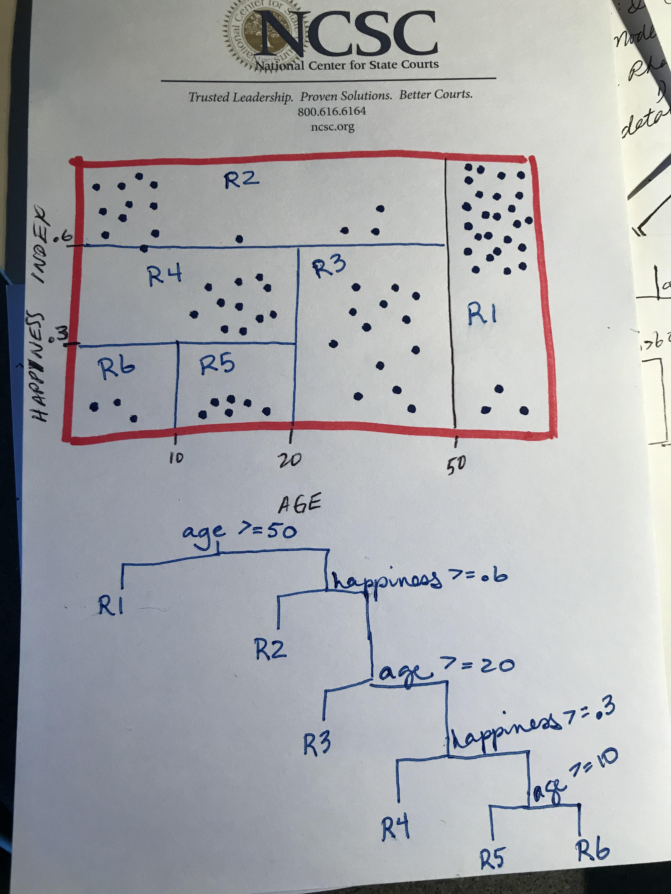

# Q1
Draw an example (of your own invention) of a partition of two-dimensional feature space that could result from recursive binary splitting. Your example should contain at least six regions. Draw a decision tree corresponding to this partition. Be sure to label all aspects of your figures, including the regions R1,R2, . . ., the cutpoints t1, t2, . . ., and so forth.


Hint: Your result should look something like Figures 8.1 and 8.2.



# Q7
In the lab, we applied random forests to the Boston data using mtry=6 and using ntree=25 and ntree=500. Create a plot displaying the test error resulting from random forests on this data set for a more comprehensive range of values for mtry and ntree. You can model your plot after Figure 8.10. Describe the results obtained.

```{r q7-setup, warning=FALSE}
library(MASS)
library(tree)
library(tidyverse)
library(partykit)
library(rattle)
library(rpart.plot)
library(RColorBrewer)
library(randomForest)
```


Setup train and test observations
```{r q7-1}

boston <- MASS::Boston
set.seed(1976)

n = nrow(boston)


train = sample(1: nrow(boston ), 406, replace = FALSE) # 406 training observations
```

The argument **mtry=13** indicates that all 13 predictors should be considered for each split of the tree. 

I want to run for m = range(1:13).

We change the number of trees grown by randomForest() using the **ntree** argument.

I want to run with ntree in seq(from = 25, to = 500, by = 25)
```{r q7-2, cache=TRUE}

out_trees = tibble()

for (m in c(1,2,3,4,5,6,7,8,9,10,11,12,13))
{
  for (nt in seq(from = 25, to = 500, by = 25))
  {
    set.seed(1976)
    tree_model = randomForest(medv∼., data = boston, subset=train, mtry = m, ntree = nt)
    preds = predict(tree_model, newdata = boston[-train,])
    preds_err = mean((preds - boston[-train, ]$medv)^2)
    
    # save the tuning and errors
    out_trees = bind_rows(out_trees, tibble(mtry = m, ntree = nt, err = preds_err))
  }
}
```

``` {r q7-3}
out_trees %>% mutate(mtry = factor(mtry)) %>% filter(err == min(err))

```

**My minimum error randomForrest used mtry = 10 and ntree = 25.**


Now I will create aplot:
```{r q7-4}
color_group = c("blue", "black", "yellow2", "red", "green", "purple", "red2", "blue3", "lightyellow3", "yellowgreen", "#00AFBB", "#E7B800", "#CC79A7")

out_trees %>% ggplot(aes(x = ntree, y = err, group=mtry, color=mtry)) + geom_point(aes(colour = factor(mtry))) #+ geom_line()


```
**Answer Q7:** One can see that the mtry = 1 performed poorly no matter the number of trees, and an mtry of 2 or 3 also performed noticably worse that greater mtry values, no matter the number of trees grown in the random forest. One can see that 10 predictors was the best balance of bias and variance when using this cross validation.

# Q9
This problem involves the OJ data set which is part of the ISLR package.

## (a) Create a training set containing a random sample of 800 observations,...
and a test set containing the remaining observations.

**About OJ Data Set**: The data contains 1070 purchases where the customer either purchased Citrus Hill or Minute Maid Orange Juice. A number of characteristics of the customer and product are recorded.

A data frame with 1070 observations on the following 18 variables.

```{r q9a-1}
oj = ISLR::OJ

oj = oj %>% mutate(Purchase = factor(Purchase), SpecialCH = factor(SpecialCH), SpecialMM = factor(SpecialMM), STORE = factor(STORE))

set.seed(1976)

train_oj = sample(1: nrow(oj ), 800, replace = FALSE) # 800 training observations

training_oj = oj[train_oj,]

head(training_oj)
```


## (b) Fit a tree to the training data, ...
with Purchase as the response and the other variables as predictors. Use the summary() function to produce summary statistics about the tree, and describe the results obtained. What is the training error rate? How many terminal nodes does the tree have?

**Process Q9b:**
I am going to try to use the rpart library for this question.

Reference: <https://www.gormanalysis.com/blog/decision-trees-in-r-using-rpart/>
**minsplit** is “the minimum number of observations that must exist in a node in order for a split to be attempted” 

**minbucket** is “the minimum number of observations in any terminal node”. 

By default, rpart uses **gini** impurity to select splits when performing classification.

Setting **cp to a negative amount** ensures that the tree will be fully grown.

**cp** corresponds to the lambda in the tuning step.

As a rule of thumb, it’s best to prune a decision tree using the cp of smallest tree that is within one standard deviation of the tree with the smallest xerror. In this example, the best xerror is 0.4 with standard deviation 0.25298. So, we want the smallest tree with xerror less than 0.65298. This is the tree with cp = 0.2, so we’ll want to prune our tree with a cp slightly greater than than 0.2.

**rpart and Cross Validation**
When rpart grows a tree it performs **10-fold cross validation on the data**. 

Use printcp() to see the cross validation results.

**xval = 0** makes this not do cross validation. (Later I will do xval = 10 for cross-validation.)

**cp = -1** ensures the tree wuth be fully grown, regardless of improvements to Rsquared with each split. I use this later in Question 9.

```{r q9b-1}
set.seed(1976) 

#tree.oj = rpart::rpart(Purchase~., data=training_oj, method='class', parms=list(split='information'), control = rpart.control(xval=0, cp=-1))

tree.oj = rpart::rpart(Purchase~., data=training_oj, method='class', parms=list(split='information'), control = rpart.control(xval=0))

```

```{r q9b-2}
summary(tree.oj)
```

``` {r q9b-3}
printcp(tree.oj)
```
**Q9b Observations:** The combination of the tree visual and the "importance" table are interesting. THe importance table shows "an overall measure of variable importance is the sum of the goodness of split measures for each split for which it was the primary variable…"  (rpart documentation <https://cran.r-project.org/web/packages/rpart/rpart.pdf>)

The importance table says that LoyalCH (brand loyalty to Citrus Hill) is by far the most "important" predictor of whether the sale is Minute Maid or Citrus Hill. This is also clear by the first node of the tree being whether LoyalCH >= 0.48. The CP table describe a root node error of 0.385. This node lowers the error rate to 47.7% of 38.5% == 18% (a significant reduction).

The additional three splits (LoyalCH >= 0.7, PriceDiff >= 0.015, and StoreID >= 2.5) lower the error rate to 42% or 18% == **8%**. We have 800 training observations, so 64 of them are misclassified after cross-validation on the training data produces this decision tree.


## (c) Type in the name of the tree object ...
in order to get a detailed text output. Pick one of the terminal nodes, and interpret the information displayed.
```{r q9c-1}
tree.oj
```
**Answer Q9c:** The node labeled "3" LoyalCH < 0.48285: 24% of the observations for this node are CH, 76% are MM. Predictions meeting the LoyalCH < 0.48285 criteria will be labeled MM using this tree.</li>

## (d) Create a plot of the tree, ...
and interpret the results.

```{r q9d-1}
fancyRpartPlot(tree.oj, caption = NULL)
```
**Answer Q9d:** Based on the tree diagram, 62% of the observations are LoyalCH >= 0.48 (85% of those CH, 15% MM), and 38% are LoyalCH < 0.48 (24% of those CH, and 76% MM). Then, 75% of the (LoyalCH >=0.48) are LoyalCH >= 0.7 and 95% of those observations are CH (5% are MM). The interpretation of the tree continues in this way. At the leaf nodes we have the followign breakdown from left to right:
<ul>
<li>Leaf 1: LoyalCH >= 0.48, LoyalCH >= 0.7: 95% CH, 5% MM</li>
<li>Leaf 2: LoyalCH >= 0.48, LoyalCH < 0.7, PriceDiff >= 0.015: 82% CH, 18% MM</li>
<li>Leaf 3: LoyalCH >= 0.48, LoyalCH < 0.7, PriceDiff < 0.015, StoreID >= 2.5 (i.e. StoreID = 3,4,5,6,...): 60% CH, 40% MM</li>
<li>Leaf 4: LoyalCH >= 0.48, LoyalCH < 0.7, PriceDiff < 0.015, StoreID < 2.5 (i.e. StoreID = 1 or 2): 21% CH, 79% MM</li>
<li>Leaf 5: LoyalCH < 0.48: 24% CH, 76% MM</li>
</ul>

## (e) Predict the response on the test data, ...
and produce a confusion matrix comparing the test labels to the predicted test labels. What is the test error rate?

```{r q9e-1}
preds_oj = predict(tree.oj, newdata = oj[-train_oj,], type = "class")
preds_oj = data.frame(Pred = factor(preds_oj))
library(caret)
caret::confusionMatrix(preds_oj$Pred, oj[-train_oj,]$Purchase)
```
**Answer Qe:** The test error rate, or 1 - Accuracy, is **0.20.**


## (f) Apply the cv.tree() function...
to the training set in order to determine the optimal tree size.

```{r}
tree.oj.10 = rpart::rpart(Purchase~., data=training_oj, method='class', parms=list(split='information'), control = rpart.control(xval=10))
fancyRpartPlot(tree.oj.10, caption = NULL)
```
**Q9f Observations:** THis is the same tree produced without cross-validation; which concerns me. I did try running the rpart with a control that set cp =-1, which ensures a fully-grown tree, and I got a **much** different result.

## (g) Produce a plot with tree size ...
on the x-axis and cross-validated classification error rate on the y-axis.

```{r q9g-1}
tree.oj.cv = rpart::rpart(Purchase~., data=training_oj, method='class', parms=list(split='information'), control = rpart.control(xval=10))
tree.oj.cv.cp = printcp(tree.oj.cv)
df.cv.cp = data.frame(tree.oj.cv.cp)
df.cv.cp
```

```{r q9g-2}
tree.oj.full = rpart::rpart(Purchase~., data=training_oj, method='class', parms=list(split='information'), control = rpart.control(xval=10, cp=-1))
tree.oj.full.cp = printcp(tree.oj.full)
df.cp = data.frame(tree.oj.full.cp)
df.cp
```
**Q9g Observations:** I create data frames for both the cross-validation that stops as soon as improvements to R2 are not greater than the CP  value, and also with cp = -1 which produced a fully grown tree. For my plot I use the data from the fully grown tree.

The x-axis, **nsplit**, is how many splits are in the tree. The y-axis is the cross-validation error, **xerror**.

```{r q9g-3}
ggplot(data=df.cp, aes(x=nsplit, y=xerror)) + geom_line() + geom_point()
```

## (h) Which tree size...
corresponds to the lowest cross-validated classification error rate?

**Answer Q9h:** The tree with 14 splits is the tree with the lowest cross-validation error rate.

To visualize this tree I set the cp to slightly larger than the cp for that tree in the cp table produced by the fully grown tree.
```{r fig.width=12}
tree.oj.14 = rpart::rpart(Purchase~., data=training_oj, method='class', parms=list(split='information'), control = rpart.control(xval=10, cp=0.0036))

fancyRpartPlot(tree.oj.14, caption = NULL)
```

## (i) Produce a pruned tree ...
corresponding to the optimal tree size obtained using cross-validation. If cross-validation does not lead to selection of a pruned tree, then create a pruned tree with five terminal nodes.

**Answer Q9i:** Cross-validation did produce a prunted tree with 5 terminal nodes.

```{r q9i-1}
fancyRpartPlot(tree.oj.10, caption = NULL)
```


## (j) Compare the training error rates between the pruned and unpruned trees. 
Which is higher?

```{r q9j-1}
printcp(tree.oj.full)
```


**Answer Q9i:** The training error rate was calculated to be **8% for the pruned tree** as shown in Q9b.

For the full tree, the root has an error rate of 0.385, then the error decreases as followed using the rel error column from the printcp(...) function:

<ul>
<li>1 split: 0.385 * 0.477 = 0.18</li>
<li>4 splits: 0.18 * 0.425 = 0.0765</li>
<li>6 splits: 0.0765 * 0.4 = 0.03</li>
<li>14 splits: 0.03 * 0.33 = 0.0099</li>
<li>17 splits: 0.0099 * 0.32 = 0.0032</li>
<li>46 splits: 0.0032 * 0.32 = **0.001**</li>
</ul>

The training error is **much** smaller in the full tree.

## (k) Compare the test error rates between the pruned and unpruned trees. 
Which is higher?

```{r q9k-1}
preds_oj_full = predict(tree.oj.full, newdata = oj[-train_oj,], type = "class")
preds_oj_full = data.frame(Pred = factor(preds_oj_full))
caret::confusionMatrix(preds_oj_full$Pred, oj[-train_oj,]$Purchase)
```
**Answer Q9i:**

Accuracy for the pruned tree on test data is 0.8 (error rate 0.2), while accuracy for the fully-grown tree on test data is 0.7963 (error rate 0.2037). While the accuracy isn't significantly greater, the tree is much simplier, easily explainable, and visualized.

